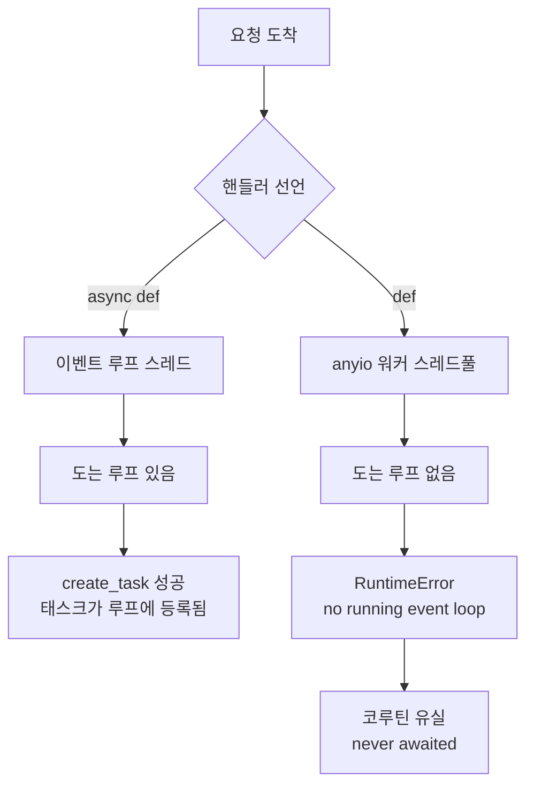
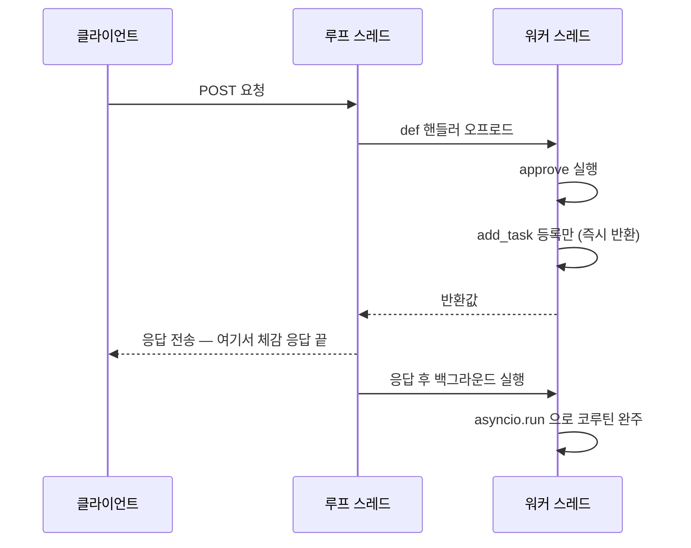

`def` 핸들러는 이벤트 루프가 아니라 스레드풀에서 돈다 — 그 안의 `asyncio.create_task()` 는 잡을 루프가 없어 코루틴째로 유실된다.
<!--more-->

## 환경

- Python 3.12
- FastAPI 0.115 / Starlette 0.45

## 문제 상황

응답을 반환한 뒤 알림 하나를 fire-and-forget 으로 쏘는 엔드포인트였다. 핸들러는
동기(`def`)로 선언돼 있었고, 본문 끝에서 코루틴을 하나 띄웠다.

```python
@router.post("/orders/{order_id}/approve")
def approve_order(order_id: int):
    result = approve(order_id)
    asyncio.create_task(notify(result))   # fire-and-forget
    return result
```

두 가지가 동시에 터졌다.

- 엔드포인트가 **500** 을 반환한다.
- 로그에 `RuntimeError: no running event loop` 가 찍히고, 곧이어
  `coroutine 'notify' was never awaited` 경고가 뜬다. 알림은 **한 번도 실행되지 않는다.**

`notify` 자체는 멀쩡하다. `create_task` 를 부르는 그 줄에서 죽는다.

## 원인

FastAPI(Starlette)는 핸들러를 선언 방식에 따라 다른 곳에서 실행한다.

- `async def` 핸들러 → 이벤트 루프 위에서 직접 실행.
- `def` 핸들러 → **스레드풀(anyio worker thread)** 에서 실행. 동기 블로킹 코드가
  이벤트 루프를 멈추지 않게 하려는 설계다.

`asyncio.create_task()` 는 "지금 이 스레드에서 **돌고 있는** 이벤트 루프"에 태스크를
붙인다. 내부적으로 `get_running_loop()` 를 부르는데, 스레드풀 워커 스레드에는 도는
루프가 없다. 그래서 `RuntimeError: no running event loop` 로 죽는다.

한 글자 차이로 코드가 어디서 실행되는지가 갈리고, 거기서 운명이 결정된다.



핸들러를 `def` 로 내린 것 자체는 의도된 선택이었다 — 동기 DB 드라이버로 블로킹
쿼리를 하는 핸들러가 커넥션 풀 고갈 시 이벤트 루프를 통째로 얼리는 문제 때문에,
이런 핸들러들을 `async def` → `def` 로 전환하던 중이었다. 전환 과정에서 본문에 남아
있던 `create_task` 가 그대로 사각지대가 됐다. `async def` 였을 땐 멀쩡히 돌던 코드가,
`def` 로 바뀌는 순간 조용히 깨진다.

## 해결

응답 반환 후 실행할 후처리는 `asyncio` 가 아니라 **Starlette 의 `BackgroundTasks`**
에 태운다. 등록된 작업은 응답이 나간 뒤 실행되고, 동기 함수는 스레드풀에서 돈다.

문제는 여기 태울 게 코루틴이라는 점이다. `BackgroundTasks` 는 sync/async 를 알아서
처리해주지만, 우리 쪽 후처리 함수엔 동기와 코루틴이 섞여 있었다. 그래서 **항상 동기
러너로 감싸고, 코루틴이면 그 스레드에서 전용 루프로 완주**시키는 헬퍼를 하나 뒀다.

```python
import asyncio, inspect
from fastapi import BackgroundTasks

def fire_and_forget(background_tasks, func, *args, **kwargs):
    background_tasks.add_task(_run, func, *args, **kwargs)

def _run(func, *args, **kwargs):
    result = func(*args, **kwargs)
    if inspect.iscoroutine(result):
        asyncio.run(result)   # 이 스레드 전용 루프에서 완주
```

```python
@router.post("/orders/{order_id}/approve")
def approve_order(order_id: int, background_tasks: BackgroundTasks):
    result = approve(order_id)
    fire_and_forget(background_tasks, notify, result)   # sync/async 무관
    return result
```

등록만 하고 즉시 반환하기 때문에, 코루틴이 도는 시점은 **응답이 나간 뒤**다.



**버린 대안 — 핸들러 안에서 직접 `asyncio.run(notify(result))`.** 스레드풀 스레드라
새 루프를 열어 돌릴 수는 있다. 하지만 그러면 알림이 끝날 때까지 응답이 블로킹된다.
위 그림에서 마지막 두 줄이 `응답 전송` **앞으로** 당겨지는 셈이다. fire-and-forget 의
의미가 사라진다.

**한 가지 주의 — 응답을 커스텀 `Response` 객체로 반환하는 경우.** 데코레이터 등이
핸들러 반환값을 `JSONResponse` 로 감싸 돌려줘도 이 방식은 동작한다. FastAPI 가 라우팅
단계에서 `response.background` 에 수집된 `BackgroundTasks` 를 채워주기 때문이다.
직접 `Response(...)` 를 만들어 반환하면서 `background=` 를 지정하지 않으면 그때는
등록한 작업이 실행되지 않으니, 그 경우엔 명시적으로 넘겨야 한다.

재발을 막으려고 AST 로 "동기 핸들러 본문의 `asyncio.create_task` / `ensure_future`
호출"을 잡는 린트 테스트를 하나 붙였다. `async def` 핸들러(루프 위)와, 같은 이름의
관계없는 메서드(예: 진행률 트래커의 `create_task()`)는 오탐이라 `asyncio.` 로 시작하는
호출만 걸러낸다.

이 버그의 뿌리는 한 문장으로 줄어든다: **"이벤트 루프는 스레드에 묶여 있고,
`create_task` 는 그 묶임을 전제한다."** 이 문장이 왜 참인지를 아래에서 층층이 푼다.

### 코루틴 객체는 그 자체로는 아무것도 하지 않는다

`notify(result)` 라고 쓰면 함수가 **실행되는 게 아니라** 코루틴 객체가 하나 생긴다.
제너레이터처럼, 코루틴은 "실행할 준비가 된 계산"을 담은 값일 뿐이다. 누군가 그것을
`await` 하거나 이벤트 루프에 태워 `send()` 를 반복 호출해줘야 비로소 코드가 돈다.

```python
async def notify(x): ...

c = notify(1)      # 아직 아무 일도 안 일어남. c 는 coroutine 객체
# 여기서 c 를 그냥 버리면 → "coroutine 'notify' was never awaited"
```

`create_task` 가 죽어버린 뒤 뜨는 `never awaited` 경고가 정확히 이 상황이다. 예외로
코루틴이 태워지지도, await 되지도 못한 채 가비지 컬렉션됐다는 신호다. 즉 **에러 한
줄과 경고 한 줄은 별개 사건이 아니라 인과**다 — `create_task` 가 예외로 죽었기
때문에 코루틴이 붕 뜬 것이다. 로그에서 이 둘을 세트로 읽을 줄 알아야 한다.

### 이벤트 루프는 스레드-로컬이다

이벤트 루프는 "지금 어떤 태스크들이 실행 대기·IO 대기 중인지"를 들고 단일 스레드에서
한 번에 하나씩 코루틴을 전진시키는 스케줄러다. asyncio 는 이 루프를 **스레드마다
따로** 관리한다 — 루프는 특정 OS 스레드에 바인딩되고, 다른 스레드에서는 그 루프가
보이지 않는다. 그래서 조회 API 가 두 종류다.

- `get_running_loop()` — **지금 이 스레드에서 실제로 돌고 있는** 루프. 없으면 `RuntimeError`.
- `get_event_loop()` — (레거시) 이 스레드에 설정된 루프를 반환하거나 없으면 만들어줌.
  돌고 있는지와 무관해서 "루프는 얻었는데 아무도 안 돌리는" 함정을 만든다. 그래서
  파이썬 3.10+ 는 루프 밖에서의 이 호출을 deprecate 했다.

`asyncio.create_task()` 는 내부적으로 `get_running_loop()` 를 부른다. **이름과 달리
루프를 만들지 않는다** — 이미 도는 루프에 태스크를 얹어 "이 코루틴도 같이 굴려달라"고
등록할 뿐이다. 그러니 도는 루프가 없는 스레드에서 부르면 등록할 대상이 없어 즉사한다.

대비되는 게 `asyncio.run(coro)` 다. 이쪽은 **새 루프를 만들어**, 코루틴이 끝날 때까지
돌리고, 루프를 닫는다. 스레드풀 워커 스레드처럼 도는 루프가 없는 곳에서 코루틴을
완주시켜야 할 때 쓰는 도구가 이거다(해결에서 헬퍼가 쓴 게 정확히 이것). 대신
`run` 은 코루틴이 끝날 때까지 **블로킹**한다 — fire-and-forget 이 아니다.

정리하면 이름이 헷갈리게 지어졌을 뿐, 역할은 명확히 갈린다.

| 함수 | 루프를 만드나 | 블로킹하나 | 도는 루프가 없으면 |
|---|---|---|---|
| `create_task(c)` | 아니오 | 아니오(등록만) | `RuntimeError` |
| `ensure_future(c)` | 아니오 | 아니오 | `RuntimeError` |
| `run(c)` | 예(새로) | 예(완주까지) | 정상 동작 |
| `await c` | 아니오 | 예(완주까지) | 문법상 async 함수 안에서만 |

### async 핸들러와 sync 핸들러는 실행되는 장소가 다르다

이벤트 루프는 단일 스레드에서 돈다. 그 스레드 위에서 블로킹 호출(동기 DB 드라이버,
파일 IO, `time.sleep`, CPU 바운드 루프)이 실행되면 루프가 그 시간 동안 **다른 어떤
요청도 전진시키지 못한다.** 한 요청의 200ms 블로킹이 전체 서버의 200ms 정지가 된다.

Starlette/ASGI 는 이 위험을 핸들러 선언 방식으로 가른다.

- `async def` → 개발자가 "이건 블로킹 안 한다"고 약속한 것으로 보고 **루프 스레드에서
  직접** 실행. 여기서는 `create_task` 가 당연히 동작한다 — 도는 루프 위니까.
- `def` → 블로킹일 수 있다고 보고 **anyio 워커 스레드풀로 오프로드**. 루프 스레드는
  자유로워져 다른 요청을 계속 처리한다. 대신 그 워커 스레드엔 도는 루프가 없다.

바로 이 지점이 함정이다. **같은 코드가 핸들러 선언 한 글자(`async`)에 따라 살고
죽는다.** `async def` 였던 핸들러를 블로킹 이슈 때문에 `def` 로 내리는 순간, 본문에
얌전히 있던 `create_task` 는 아무 경고 없이 실행 위치가 루프 밖으로 바뀌어 깨진다.
리팩터링이 유발하는 이런 "위치 의존 버그"는 타입 체커도 못 잡는다 — 그래서 해결에서
AST 린트로 못을 박은 것이다.

말로 읽는 것보다 한 번 돌려보는 쪽이 빠르다. 핸들러 선언과 후처리 호출을 바꿔가며
**재생**을 눌러보면, 코루틴이 어느 스레드에서 도는지 · 언제 죽는지 · 응답이 언제
나가는지가 타임라인 위에서 그대로 보인다.



여섯 조합을 요약하면 이렇다. `create_task` 는 **루프 위에서만** 살고, `asyncio.run` 은
**루프 밖에서만** 살되 블로킹을 대가로 치른다. 응답 블로킹 없이 코루틴을 실제로
완주시키는 조합은 `BackgroundTasks` 쪽 둘뿐이다. 한 가지 더 — `async def` + `create_task`
는 동작하지만, 루프가 태스크를 **약한 참조로만** 붙들기 때문에 반환된 태스크 객체를
아무도 들고 있지 않으면 완료 전에 GC 될 수 있다. 루프 위라고 fire-and-forget 이
공짜인 건 아니다.

(참고로 스레드풀 오프로드에는 anyio 의 `CapacityLimiter` 로 동시 실행 상한이 걸린다.
즉 `def` 로 내린다고 무한 병렬이 되는 게 아니라, 스레드 자원 안에서 관리된다.)

### 응답 후 후처리의 자리 — 그리고 그 한계

`BackgroundTasks` 는 ASGI 응답 전송이 **끝난 뒤** 실행된다. 그래서 후처리 시간이
클라이언트 응답 지연에 얹히지 않는다. sync/async 작업을 둘 다 받고, sync 는
스레드풀에서 돌린다 — 이 글의 헬퍼는 여기에 "코루틴이면 전용 루프로 완주"만 얹은
얇은 어댑터다.

한계도 분명히 알아야 한다. `BackgroundTasks` 는 **같은 프로세스, 응답 직후, 짧게**
하는 후처리의 자리다. 프로세스가 죽으면 태스크도 같이 죽고, 재시도도 영속성도 없다.
"반드시 완료돼야 하는" 작업(결제 후속, 정산, 장시간 배치)을 여기 태우면 배포·크래시
한 번에 유실된다. 그 층위는 외부 큐/워커(별도 프로세스 + 원장 + 재시도)의 몫이다.

그리고 이 모든 이야기의 밑바닥에는 **"코루틴을 루프 밖에서 fire-and-forget 하려는
시도 자체가 항상 어댑터를 요구한다"** 는 원칙이 있다. `create_task` 는 루프 위에서만,
`run` 은 블로킹으로만, `await` 는 async 함수 안에서만 코루틴을 굴린다. "루프도 없는
동기 문맥에서, 블로킹도 없이, 나중에" 굴리고 싶다면 — 그 셋 중 어느 것도 그대로는
맞지 않고, 실행 시점을 옮겨줄 무언가(여기서는 `BackgroundTasks`)가 반드시 끼어야 한다.

## 참고

- [Starlette — Background Tasks](https://www.starlette.io/background/)
- [asyncio — `create_task` / `get_running_loop`](https://docs.python.org/3/library/asyncio-task.html)
