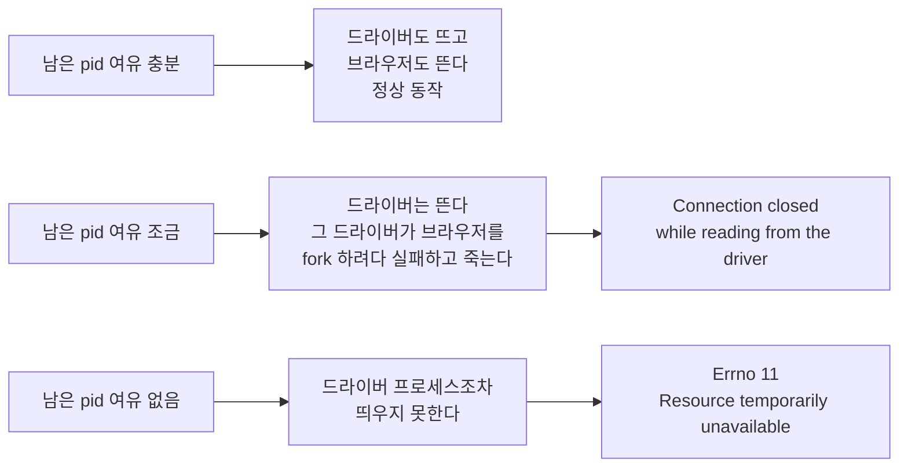
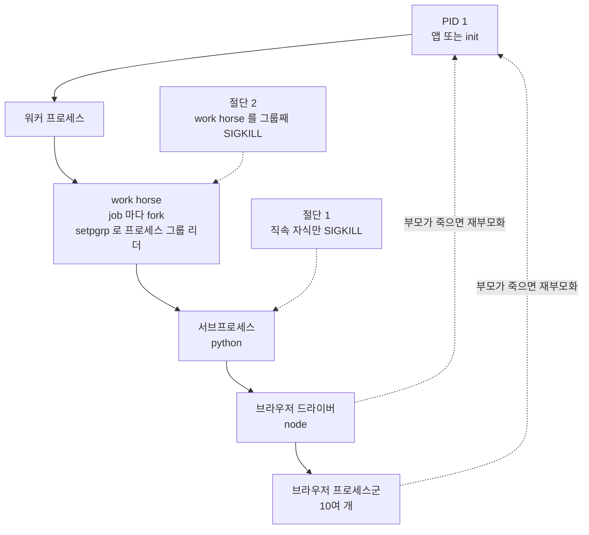
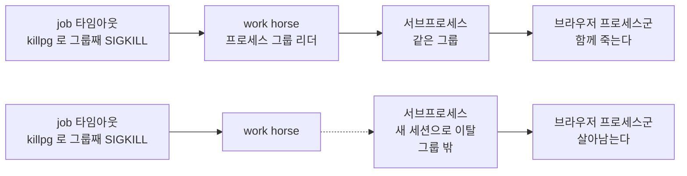

`subprocess.run(timeout=)` 은 손자를 죽이지 않고, PID 1 이 애플리케이션이면 죽은 손자를 거두지도 않는다. pid 가 두 갈래로 샌다.
<!--more-->

## 환경

- Python 3.12 (CPython), Linux 컨테이너 (Docker)
- 작업 큐: RQ 2.6.1 — job 마다 work horse 를 `fork()` 하는 표준 Worker 모드
- 브라우저 자동화: Playwright 계열 (Node 드라이버 프로세스 + Chromium 프로세스군)
- 워커 컨테이너가 브라우저를 띄우는 배치 작업을 20분 주기로 처리한다
- psutil 5.9+

## 문제 상황

브라우저 자동화 배치 작업이 무더기로 실패했다. 관찰된 에러는 **두 종류**였다.

```
BlockingIOError: [Errno 11] Resource temporarily unavailable
```

스택은 드라이버 프로세스를 띄우는 지점이었다 — `asyncio.create_subprocess_exec` → `subprocess.Popen` → `_fork_exec`.

```
BrowserType.launch: Connection closed while reading from the driver
```

중요한 건 어느 쪽이 몇 건이냐가 아니라 **순서**였다. 둘은 번갈아 나온 게 아니라 **단계적으로 바뀌었다.** 시간당 실패 건수를 에러 문구별로 세어 보면 이렇다.

```chart
{ "type": "bar",
  "data": {
    "labels": ["22시","23시","00시","01시","02시","03시","04시","05시","06시","07시"],
    "datasets": [
      { "label": "Connection closed while reading from the driver",
        "data": [8, 106, 50, 100, 50, 62, null, null, null, null],
        "backgroundColor": "#9aa4ad" },
      { "label": "Errno 11 Resource temporarily unavailable",
        "data": [null, null, null, null, null, null, 95, 153, 170, 204],
        "backgroundColor": "#c0292c" }
    ]
  },
  "options": {
    "legend": { "position": "bottom" },
    "scales": {
      "xAxes": [{ "stacked": true, "gridLines": { "display": false } }],
      "yAxes": [{ "stacked": true, "ticks": { "beginAtZero": true } }]
    }
  } }
```

앞쪽 여섯 시간은 전부 `Connection closed` 였고, 새벽 4시를 넘어가면서 `Errno 11` 로 **갈아탄 뒤 시간당 204건까지 단조 증가**했다. 이틀치 전체를 보면 이렇게 움직였다.

| 구간 | 나온 에러 | 시간당 실패 건수 |
|---|---|---|
| 1일차 22시 ~ 2일차 03시 | `Connection closed` | 8 → 106 → 50 → 100 → 50 → 62 |
| 2일차 04시 ~ 07시 | `Errno 11` | 95 → 153 → 170 → 204 |
| **2일차 08시** | **← 컨테이너 재시작** | **실패 0건, 성공 14건** |
| 2일차 08시 ~ 15시 | 없음 | 정상 (성공 28, 25 …) |
| 2일차 16시 | `Errno 11` | 11건 ← 다시 새기 시작 |
| 2일차 21시 ~ | `Connection closed` | 26 → 42 → 56 → 27 |

**재시작으로 리셋되고, 약 8시간에 걸쳐 다시 차오른다.** 단조 증가 + 재시작이 고치는 것 — 자원 누수의 교과서적 신호다. 남은 질문은 하나였다. *어떤* 자원인가.

## 재현

컨테이너도 브라우저도 필요 없다. 표준 라이브러리 세 줄이면 절반은 재현된다.

```python
# leak.py — 자식이 손자를 남기고, 부모는 자식만 죽인다
import subprocess, sys, time

role = sys.argv[1] if len(sys.argv) > 1 else "parent"

if role == "grandchild":
    time.sleep(600)

elif role == "child":
    subprocess.Popen([sys.executable, __file__, "grandchild"])
    time.sleep(600)                       # 부모가 죽여 줄 때까지 버틴다

else:
    try:
        subprocess.run([sys.executable, __file__, "child"], timeout=2)
    except subprocess.TimeoutExpired:
        print("timeout — 자식은 죽였다")
```

```
$ python3 leak.py
timeout — 자식은 죽였다

$ ps -eo pid,ppid,args | grep 'leak.py grandchild'
  8127     1 python3 leak.py grandchild
```

부모는 정상 종료했고 자식도 죽었는데, **손자는 `ppid 1` 을 달고 살아 있다.** `timeout=` 이 지켰다고 믿은 계약은 "이 명령이 N초 안에 끝난다" 였지만, 실제로 보장한 것은 "직속 자식 하나가 N초 뒤 SIGKILL 된다" 뿐이다.

이 손자가 헤드풀 Chromium 이면 한 번에 프로세스 10여 개다. 20분마다 반복하면 어떻게 되는지는 위 시계열 그대로다.

## 원인

### 1. `EAGAIN` 은 메모리 부족이 아니다

가장 먼저 헛짚기 쉬운 지점이다. `fork(2)` 가 돌려주는 `EAGAIN` — 파이썬에서는 `BlockingIOError: [Errno 11]` — 은 **"프로세스나 스레드를 더 만들 수 없다"** 는 뜻이다. 원인은 셋 중 하나다.

- `RLIMIT_NPROC` 도달 (uid 당 프로세스 수)
- cgroup `pids.max` 도달 (컨테이너에 걸린 pid 상한)
- 시스템 전역 thread 한계

메모리가 모자라서 fork 가 실패하면 그건 `ENOMEM` 이다. 문구가 "temporarily unavailable" 이라 리소스 압박처럼 읽히고, 브라우저를 띄우는 워커라는 맥락까지 겹치면 자연스럽게 "메모리를 늘리자" 로 간다. **완전히 헛짚는 방향이다.** 뒤에 볼 좀비 프로세스는 메모리를 한 바이트도 쓰지 않으면서 pid 만 먹기 때문에, 메모리 그래프는 끝까지 평온하다.

### 2. 같은 병의 초기 증상과 말기 증상

에러가 두 종류였던 이유는 병이 둘이어서가 아니었다.



pid 에 여유가 조금 남아 있으면 Node 드라이버는 뜬다. 그 드라이버가 Chromium 을 `fork` 하려다 실패하고 죽으면, 부모인 파이썬 쪽에서 보이는 건 **"드라이버를 읽는 중에 연결이 끊겼다"** 다. pid 가 아예 없으면 드라이버 프로세스조차 못 띄우고 **그 자리에서 `Errno 11`** 이 터진다.

증상 문구가 다르다고 다른 병이 아니었다. **자원 고갈은 고갈된 정도에 따라 다른 층위에서 다른 얼굴로 드러난다.** 시계열 위에 겹쳐 놓았을 때 둘이 한 곡선으로 합쳐지는 것이 그 증거다.

### 3. pid 를 먹는 것이 둘이다 — 살아있는 고아와 죽은 좀비



**(a) `subprocess.run(timeout=)` 은 직속 자식만 죽인다.** 타임아웃이 나면 `proc.kill()` 후 `wait()` 한다. 여기서 죽는 것은 위 그림의 **절단 1** — 직속 자식 하나뿐이다. 그 아래 드라이버와 브라우저 프로세스군은 그대로 살아남아 PID 1 로 입양된다. §재현에서 본 그대로다.

**(b) 워치독의 `os._exit()` 도 마찬가지다.** 정리 없이 즉시 끊는 코드 경로 — 하드 타임아웃 워치독 같은 것 — 는 자기가 띄운 브라우저를 그대로 남긴다.

**(c) 컨테이너의 PID 1 이 애플리케이션이면 좀비가 영구 누적된다.** 이쪽이 가장 안 보인다. 고아가 된 프로세스는 PID 1 로 재부모화된다. 그 고아가 **죽으면** 종료 상태를 누군가 `wait()` 해 줘야 프로세스 테이블에서 사라지는데, 그건 이제 부모가 된 PID 1 의 책임이다. 그런데 PID 1 이 파이썬 애플리케이션이면 **자기가 만든 자식만 거둔다.** 입양된 남의 자식은 영원히 `wait()` 되지 않는다.

`Z` 상태의 defunct 좀비는 메모리도 CPU 도 쓰지 않지만 **pid 번호는 계속 점유한다.** 그래서 브라우저를 잘 죽여도 pid 는 회수되지 않는다.

누수원이 둘이고, **고치는 층위도 서로 다르다.**

## 해결

### 채택 1 — 프로세스 트리 통째로 죽이기

```python
def kill_process_tree(pid, grace_sec=3.0, include_root=True):
    parent = psutil.Process(pid)
    # 부모가 살아있는 동안 자손을 먼저 스냅샷한다.
    # 부모부터 죽이면 손자의 ppid 가 1 로 바뀌어 트리에서 사라진다.
    targets = parent.children(recursive=True)
    if include_root:
        targets.append(parent)
    for p in targets:
        p.kill()
    psutil.wait_procs(targets, timeout=grace_sec)
```

주석의 한 줄이 이 함수의 전부다. **자손 목록은 부모를 죽이기 전에 떠야 한다.** 부모를 먼저 죽이면 손자들의 `ppid` 가 그 순간 1 로 바뀌고, `children(recursive=True)` 는 더 이상 그들을 찾지 못한다. 죽이려던 대상이 죽이는 행위 자체로 목록에서 사라진다.

호출부는 `run()` 을 `Popen` 으로 내린다.

```python
proc = subprocess.Popen(cmd, stdout=PIPE, stderr=PIPE, text=True)
try:
    stdout, stderr = proc.communicate(timeout=TIMEOUT)
except subprocess.TimeoutExpired:
    kill_process_tree(proc.pid)
    proc.communicate()
    return TIMEOUT_RESULT
```

`include_root=False` 는 워치독이 `os._exit()` 로 끊기 직전에 자기 자식만 치울 때 쓴다. 자기 자신을 SIGKILL 하면 그 뒤 코드가 돌지 않으니까.

### 채택 2 — 고아 판정은 나이가 아니라 `ppid == 1`

```python
def reap_orphan_browsers():
    for p in psutil.process_iter(["ppid", "name", "cmdline"]):
        if p.info["ppid"] != 1:
            continue          # 부모가 살아있다 = 진행 중인 작업의 브라우저다
        blob = f"{p.info['name']} {' '.join(p.info['cmdline'] or [])}".lower()
        if any(h in blob for h in BROWSER_HINTS):
            p.kill()
```

작업 큐의 **모든 job 이 지나는 단일 관문** — job 실행 진입점 — 에서 job 시작 직전에 한 번 부른다. 특정 도메인 큐에만 붙이면 빠짐없이 커버할 수 없다. 누수는 브라우저를 띄우는 모든 경로에서 생기지 이번에 문제가 된 경로에서만 생기는 게 아니다.

### 채택 3 — PID 1 을 init 으로, 그것도 이미지에 굽는다

```dockerfile
RUN apt install -y ... tini
ENTRYPOINT ["/usr/bin/tini", "--", "bash", "/app/entrypoint.sh"]
```

같은 프로브 이미지로 대조 실험을 했다. **ENTRYPOINT 한 줄만 다르다.** 백그라운드 프로세스를 하나 띄우고 `exec` 로 파이썬이 된 뒤, 자식이 손자를 남기고 즉시 죽게 해서 손자를 고아로 만든다. 그 손자가 죽고 나서 `/proc/*/stat` 의 상태 문자가 `Z` 인 항목을 세었다.

| ENTRYPOINT | PID 1 | 고아 사망 후 좀비 |
|---|---|---|
| `bash entrypoint.sh` | `python3` | **1개 영구 잔존** |
| `tini -- bash entrypoint.sh` | `tini` | 0개 (수거됨) |

`docker run --init` 으로도 같은 효과를 낼 수 있다. 그런데 **런타임 플래그에 기대지 않았다.** 배포가 PaaS 자동 빌드라 실행 옵션을 붙일 자리가 없고, 관리 UI 설정은 서비스를 재생성하면 조용히 사라지는 종류다. 이미지에 구우면 어디서 어떻게 띄우든 항상 먹는다.

graceful shutdown 도 그대로 산다. tini 는 SIGTERM 을 직속 자식에게 전달하고, 그 자식은 `exec` 사슬(bash → bash → python)을 거쳐 워커 프로세스가 된다 — `exec` 는 pid 를 유지하므로 신호는 최종 프로세스까지 닿는다. 실험에서 종료 코드 0 으로 내려가는 것까지 확인했다.

### 버린 대안 1 — `start_new_session=True` + `killpg`

이 글의 핵심이 여기다. 처음에 낸 "명백해 보이는" 수정은 이거였다.

```python
proc = subprocess.Popen(cmd, start_new_session=True)   # ← 위험
try:
    proc.communicate(timeout=TIMEOUT)
except subprocess.TimeoutExpired:
    os.killpg(proc.pid, signal.SIGKILL)   # 그룹째 한 방에
```

자식을 프로세스 그룹 리더로 만들어 손자까지 한 번에 잡는 정석 패턴이다. 파이썬 레벨 타임아웃 경로에서는 실제로 잘 동작한다.

그런데 **바깥에 이미 안전망이 있었다.** 작업 큐 라이브러리 소스를 확인해 보니 (RQ 2.6.1):

- work horse 를 fork 한 직후 자식에서 `os.setpgrp()` 를 호출한다 → work horse 가 자기 프로세스 그룹의 리더가 된다
- job 타임아웃 시 `os.killpg(os.getpgid(horse_pid), SIGKILL)` 로 **그룹째** 죽인다

즉 work horse 그룹 안에 있기만 하면 **그 아래 모든 자손이 자동으로 정리된다.** 그런데 `start_new_session=True` 는 정확히 그 그룹을 탈출한다.



파이썬 레벨 타임아웃 한 경로를 고치는 대가로, **job 타임아웃이 걸려도 브라우저가 살아남는 경로를 새로 만드는** 셈이다. 안전망을 벗어난 만큼을 스스로 다 책임져야 하는데, `SIGKILL` 로 끊기는 경로에서는 애플리케이션이 아무 코드도 실행할 수 없으므로 책임질 방법이 없다.

**교훈: 프로세스 정리 코드를 쓰기 전에, 나를 감독하는 층이 이미 뭘 해 주는지 읽어라.** 안전망 안에 머무르면서 안전망이 못 덮는 구간 — 앱이 스스로 판단하는 타임아웃 — 만 메우는 게 맞다. 채택 1 이 프로세스 그룹을 건드리지 않고 트리만 훑는 이유다.

### 버린 대안 2 — 나이 기반 리퍼

"N초 넘게 산 브라우저는 좀비다" 는 휴리스틱은 **"원래 오래 걸리는 작업"과 구분하지 못한다.** 그래서 기존 구현은 오탐이 무서워 특정 브라우저 계열만 좁게 잡고 있었고, 정작 이번 사고의 주범인 다른 계열은 아예 건드리지 못했다.

`ppid == 1` 은 나이와 무관하게 **정의상** 고아다. 오탐이 없으니 대상을 넓게 잡을 수 있다. 판정을 느슨하게 하는 대신 술어를 정확하게 바꾼 것이다.

### 개발 중 실제로 당한 것 — 리퍼는 컨테이너 안에서만 돌린다

`ppid == 1` 리퍼의 자체 검증을 개발용 macOS 머신에서 돌렸더니 **브라우저 프로세스 10개를 죽였다.** macOS 는 GUI 앱을 launchd 가 띄우기 때문에 데스크톱 브라우저의 헬퍼 프로세스들은 `ppid` 가 1 이다. 컨테이너에서 "부모 없음 = 고아" 인 판정이 데스크톱에서는 "부모 없음 = 정상" 으로 뒤집힌다.

```python
def in_container():
    return os.path.exists("/.dockerenv") or os.environ.get("IN_CONTAINER") == "1"
```

가드를 달고 "컨테이너 밖에서는 0개를 죽인다" 를 테스트로 고정했다. 일반화할 수 있는 교훈은 이거다 — **"고아" 같은 판정 술어는 실행 환경에 따라 의미가 뒤집힐 수 있다.** 술어 자체는 참인데 그 술어가 가리키는 집합이 환경마다 다르다.

## 관련 이론

아래 시뮬레이터가 이 글의 요약이다. 축 세 개를 바꿔 가며 **`job 이 끝난 뒤 남은 pid` 가 0 으로 떨어지는지**만 보면 된다. 떨어지지 않는 조합에서 무엇이 남는지 — 살아있는 고아인지 좀비인지 — 가 각각 다른 대책을 요구한다.



12칸을 다 눌러 보면 두 가지가 읽힌다.

1. **`PID 1 = init` 은 거의 모든 칸의 전제 조건이다.** 정리 코드를 아무리 잘 짜도 PID 1 이 애플리케이션이면 죽인 자리에 좀비가 남는다. 애플리케이션 코드로는 넘을 수 없는 층위다.
2. **세션 분리는 앱 타임아웃에서만 좋아 보이고 외부 그룹 kill 에서 최악이 된다.** "정석 패턴"이 바깥 안전망과 충돌하는 순간이 그 칸이다. 두 트리거 모두에서 깨끗한 조합은 **트리 kill + init** 하나뿐이다.

### 근본 원리 — 죽는 것과 거둬지는 것은 다른 일이다

pid 는 커널 프로세스 테이블의 인덱스다. 프로세스가 `exit()` 하면 주소 공간·파일 디스크립터·스레드는 그 자리에서 반납되지만, **테이블 엔트리 자체는 남는다.** 거기에 종료 상태(exit status)가 들어 있고, 그건 부모가 읽어 가야 할 값이기 때문이다. 부모가 `wait()` 계열 호출로 그 값을 수거해야 비로소 엔트리가 지워지고 pid 번호가 재사용 가능해진다.

그 사이 상태가 `Z` — defunct, 흔히 말하는 좀비다. **좀비는 자원을 안 쓴다. 자원의 이름표만 붙들고 있다.** `top` 도 메모리 그래프도 조용한데 `fork` 만 실패하는 이유가 정확히 이것이다.

여기서 원리 한 문장이 나온다.

> 프로세스는 **죽는 것**과 **거둬지는 것**이 다른 일이고, 둘 중 하나만 해서는 pid 가 회수되지 않는다.

이 문장이 §해결의 세 대책을 전부 설명한다. 채택 1·2 는 "죽이는" 쪽이고, 채택 3 은 "거두는" 쪽이다. 둘은 대체재가 아니다.

### 그래서 고아는 어디로 가는가

부모가 먼저 죽으면 자식은 **고아**가 된다. 커널은 고아를 그냥 두지 않고 재부모화(reparent)한다 — 기본적으로 PID 1 이고, 중간에 `prctl(PR_SET_CHILD_SUBREAPER)` 를 건 조상이 있으면 가장 가까운 그 조상이다.

여기서 두 개념이 갈린다. 이름이 비슷해서 자주 섞여 쓰이지만 상태도 대책도 다르다.

| | 고아(orphan) | 좀비(zombie) |
|---|---|---|
| 상태 | **살아 있다.** 계속 실행되고 CPU·메모리를 쓴다 | **죽었다.** 테이블 엔트리만 남았다 |
| 생기는 조건 | 부모가 먼저 죽었다 | 죽었는데 부모가 `wait()` 하지 않았다 |
| 먹는 것 | pid + 메모리 + CPU | pid 만 |
| 없애는 법 | **죽여야 한다** (애플리케이션의 몫) | **거둬야 한다** (PID 1 의 몫) |

고아는 시간이 지나면 죽고, 죽은 뒤에는 좀비가 될 **후보**가 된다. 즉 이 둘은 대립 관계가 아니라 **같은 프로세스의 두 시점**이다. 고아를 죽여도 PID 1 이 안 거두면 좀비로 자리를 옮길 뿐이고, PID 1 을 init 으로 바꿔도 고아가 안 죽으면 애초에 거둘 것이 없다.

### PID 1 이 특별한 이유

커널이 pid 1 에게 주는 특별대우는 두 가지다.

- **기본 시그널 처리가 다르다.** 핸들러를 등록하지 않은 시그널은 무시된다. 그래서 애플리케이션을 PID 1 로 띄우면 `SIGTERM` 핸들러가 없을 때 `docker stop` 이 먹지 않고 타임아웃 뒤 `SIGKILL` 로 끝난다.
- **고아의 최종 부모다.** 그래서 좀비 수거 책임이 자동으로 따라온다.

init 으로 설계된 프로그램은 이 두 가지를 아는 상태로 짜여 있다. `tini` 는 200줄 남짓의 프로그램이고 하는 일이 딱 두 개다 — 받은 시그널을 자식에게 전달하고, `SIGCHLD` 가 올 때마다 `waitpid(-1, WNOHANG)` 를 돌려 거둘 게 없어질 때까지 거둔다. **애플리케이션이 PID 1 이 되는 순간, 이 두 가지가 애플리케이션의 책임이 된다.** 대부분의 애플리케이션은 그걸 모른다.

### 프로세스 그룹과 세션 — `killpg` 가 닿는 범위

프로세스는 pid 외에 **pgid**(프로세스 그룹)와 **sid**(세션)를 갖는다. 셸의 잡 컨트롤을 위해 만들어진 개념이지만, 지금 우리가 쓰는 용도는 "한 덩어리를 한 번에 죽이기" 다.

- `os.setpgrp()` — 새 프로세스 **그룹**을 만들고 그 리더가 된다. 세션은 그대로.
- `os.setsid()` / `subprocess.Popen(start_new_session=True)` — 새 **세션**을 만든다. 세션을 만들면 새 그룹도 함께 생기고, 제어 터미널에서도 떨어져 나온다.
- `os.killpg(pgid, sig)` — 그 그룹에 속한 **모든** 프로세스에 시그널을 보낸다. 트리를 훑지 않는다. 커널이 pgid 로 필터링할 뿐이다.

`fork` 는 pgid 와 sid 를 **상속**한다. 그래서 아무것도 안 하면 자손 전체가 조상의 그룹에 그대로 남고, 조상 그룹에 대한 `killpg` 하나가 전부를 쓸어 간다 — §해결의 안전망이 정확히 이 성질이다.

여기서 이름이 오해를 부른다. `start_new_session=True` 는 "이 서브프로세스를 격리한다" 처럼 읽히고, 실제로 그 격리는 **자식 방향으로는** 이득이다(손자까지 한 번에 잡을 수 있다). 하지만 격리는 **부모 방향으로도** 작동한다. 나를 감독하던 상위의 `killpg` 도 함께 끊긴다. 격리에는 방향이 없다.

| 개념 A | 개념 B | 차이 |
|---|---|---|
| `EAGAIN` (fork) | `ENOMEM` (fork) | 프로세스 슬롯 부족 / 메모리 부족. `EAGAIN` 을 메모리 문제로 읽으면 헛짚는다 |
| 고아 | 좀비 | 부모가 먼저 죽은 **살아있는** 프로세스 / 죽었는데 `wait()` 안 된 **죽은** 항목 |
| `os.setpgrp()` | `os.setsid()` / `start_new_session=True` | 새 **그룹** / 새 **세션**(그룹까지 함께 이탈). 후자는 바깥 `killpg` 안전망을 벗어난다 |
| `proc.kill()` | `os.killpg(pgid, sig)` | 프로세스 1개 / 프로세스 그룹 전체 |
| `subprocess.run(timeout=)` | `Popen` + 직접 정리 | 직속 자식만 정리 / 자손까지 정리 가능 |
| `SIGTERM` | `SIGKILL` | 핸들러로 정리 가능 / 커널이 즉시 회수, 정리 코드 실행 불가 |
| PID 1 = 앱 | PID 1 = init | 입양된 자식 미수거 → 좀비 누적 / 자동 수거 |

### `subprocess.run(timeout=)` 이 손자를 못 죽이는 것은 버그가 아니다

`run()` 은 `Popen` 위의 얇은 래퍼다. 타임아웃이 나면 `proc.kill()` — 즉 `os.kill(pid, SIGKILL)` — 을 부르고 `wait()` 한다. `Popen` 이 아는 것은 자기가 만든 pid 하나뿐이고, 그 pid 가 그 뒤에 무엇을 fork 했는지는 알 방법이 없다. **표준 라이브러리가 손자의 존재를 모르는 게 정상이다.** 손자를 어떻게 다룰지는 정책이고, 정책은 호출자 몫이다.

그래서 자손까지 정리하려면 방법은 둘뿐이다. 커널에게 물어보거나(`psutil` 이 `/proc` 을 훑어 트리를 만든다), 미리 프로세스 그룹으로 묶어 두거나(`killpg`). 우리가 고른 것은 앞쪽이고, 그 이유는 뒤쪽이 이미 상위 층에서 쓰이고 있었기 때문이다.

여기 딸린 함정이 하나 더 있다. 파이프를 열어 둔 채 타임아웃이 나면 **`communicate()` 가 자식이 죽은 뒤에도 블록될 수 있다.** `stdout`/`stderr` 파이프의 쓰기 끝은 `fork` 로 손자에게도 복제되므로, 자식만 죽여서는 파이프가 EOF 가 되지 않는다. 파이프를 붙들고 있는 마지막 프로세스가 죽어야 읽기 쪽이 풀린다. §해결의 호출부가 `kill_process_tree()` 를 **먼저** 부르고 `communicate()` 를 나중에 부르는 순서인 이유다. 순서를 뒤집으면 타임아웃을 처리하다 무기한 멈춘다.

### pid 상한은 어디에 걸려 있나

`EAGAIN` 을 만났을 때 어느 천장에 부딪혔는지는 세 군데를 보면 갈린다.

| 천장 | 범위 | 확인 |
|---|---|---|
| `RLIMIT_NPROC` | uid 당 | `ulimit -u`, `/proc/self/limits` |
| cgroup `pids.max` | 컨테이너/그룹 당 | `pids.current` / `pids.max` |
| `kernel.pid_max`, `threads-max` | 시스템 전역 | `sysctl` |

컨테이너에서 압도적으로 흔한 건 가운데다. 컨테이너 런타임이 pid 상한을 걸어 두는 이유가 fork bomb 격리이고, 브라우저처럼 프로세스를 수십 개 쓰는 워크로드는 그 상한에 정상적으로도 꽤 가까이 간다. **여유가 원래 적은 곳에 누수를 얹으면 도달이 빠르다.**

그리고 이 값은 **읽을 수 있다.** `pids.current / pids.max` 를 주기적으로 읽어 80% 에서 경고를 남기면, `EAGAIN` 이 터지기 전에 곡선이 보인다. 이게 중요한 이유는 다음 절이다.

### 재시작이 증거를 지운다

이 사고의 진단을 어렵게 만든 것은 **대응이 증거를 삭제한다**는 구조였다. 장애가 나면 컨테이너를 재시작하고, 재시작하면 `pids.current` 도 프로세스 목록도 통째로 사라진다. 다음 날 조사에 들어갈 때 남아 있는 것은 애플리케이션 로그의 에러 문구뿐이고, 그 문구만으로는 §원인 1 의 세 갈래 중 어느 것인지 알 수 없다.

일반화하면 이렇다. **"재시작하면 낫는다"는 그 자체로 진단 정보다.** 단조 증가 + 재시작 리셋이면 자원 누수고, 어떤 자원인지는 그다음 문제다. 그런데 같은 재시작이 "어떤 자원인지"의 증거를 지운다. 그래서 누수가 의심되는 워크로드에는 **임계 도달 전에 곡선을 남기는 계측**이 사후 분석용 로그보다 먼저 필요하다.

### 이 해법의 한계와 그걸 맡는 층위

채택한 대책들이 각각 어디까지만 책임지는지 선을 그어 두는 게 중요하다.

- **애플리케이션 코드는 죽은 프로세스를 거둘 수 없다.** 좀비 수거는 PID 1 의 권한이자 책임이라 컨테이너 이미지/런타임 층에서만 해결된다. 코드를 아무리 잘 짜도 이건 못 메운다.
- **반대로 init 은 살아있는 고아를 죽이지 않는다.** `tini` 는 수거만 한다. 살아있는 고아는 애플리케이션(리퍼)이 죽여야 한다.
- 즉 두 대책은 대체재가 아니라 **보완재**다. 하나만 하면 절반만 해결된다. 위 시뮬레이터에서 `PID 1 = init` 을 켜도 `직속 자식만` 조합이 여전히 빨간 이유가 그것이다.
- **`SIGKILL` 로 죽는 경로에서는 애플리케이션이 어떤 정리 코드도 실행할 수 없다.** 외부 감독자가 강제 종료하는 구간이 여기다. 그 구간은 오직 **프로세스 그룹 설계**로만 커버된다 — 미리 같은 그룹에 묶여 있어야 한다. 이것이 세션 분리를 버린 진짜 이유다.

### 이건 브라우저 워커만의 이야기가 아니다

**자식 프로세스를 만드는 모든 컨테이너**가 같은 조건에 놓인다. 빌드 도구를 부르는 CI 러너, 헤드리스 브라우저, `ffmpeg` 래퍼, 셸 스크립트를 호출하는 API 서버 — 애플리케이션을 PID 1 로 띄우는 순간 좀비 수거 책임이 그 애플리케이션에 생긴다. 대부분은 자식이 금방 끝나고 부모가 제대로 `wait()` 하기 때문에 표면화되지 않을 뿐이다. 표면화되는 조건은 **손자가 생기고, 중간 부모가 비정상 종료하는 것** 하나다.

체크리스트로 줄이면 세 줄이다.

1. 컨테이너의 PID 1 이 무엇인지 확인한다. 애플리케이션이면 init 을 앞에 세운다.
2. 서브프로세스에 타임아웃을 걸었다면, 그 명령이 손자를 만드는지 묻는다. 만든다면 `run(timeout=)` 으로는 부족하다.
3. 정리 코드를 새로 쓰기 전에, 나를 감독하는 층이 이미 무엇을 해 주는지 읽는다.

### 확정과 추정의 경계

이 글에서 확정인 것과 아닌 것을 분리해 둔다.

**확정**

- `subprocess.run(timeout=)` 이 손자를 남긴다는 것 — §재현으로 재현된다.
- PID 1 이 애플리케이션이면 입양된 고아의 시체가 좀비로 영구 잔존한다는 것 — §해결의 대조 실험으로 확정했다. `tini` 를 앞에 세우면 0 개가 된다.
- 실패가 단조 증가하고 컨테이너 재시작으로 리셋된다는 것 — 시계열 실측.

**추정**

- **누적된 것이 살아있는 고아인지 좀비인지, 그 비율은 측정하지 못했다.** 장애 대응으로 컨테이너를 재시작하면서 `pids.current` 와 프로세스 목록이 통째로 날아갔다. 좀비가 실제로 누적된다는 것은 대조 실험으로 확정했지만, 운영에서 어느 쪽이 더 많이 쌓였는지는 모른다.
- **`Connection closed while reading from the driver` 가 pid 고갈 때문인지 메모리 압박 때문인지는 구분하지 못했다.** 두 에러가 같은 시계열 위에서 단계적으로 이동하고 재시작으로 동시에 리셋된다는 점에서 같은 뿌리로 판단했지만, 드라이버가 죽은 직접 원인은 확인하지 못했다. 다만 고아 브라우저는 pid 와 메모리를 **둘 다** 먹으므로 어느 쪽이든 대책은 같다.
- **수정 배포 후 재발이 멈추는지는 이 글을 쓰는 시점에 아직 관측되지 않았다.** 배포가 반영됐는지는 리퍼가 남기는 로그 라인으로 확인하도록 계측만 해 둔 상태다.

## 참고

- [Python — `subprocess.run`](https://docs.python.org/3/library/subprocess.html#subprocess.run)
- [man7 — `fork(2)`](https://man7.org/linux/man-pages/man2/fork.2.html)
- [man7 — `wait(2)`](https://man7.org/linux/man-pages/man2/wait.2.html)
- [man7 — `setsid(2)`](https://man7.org/linux/man-pages/man2/setsid.2.html)
- [Linux kernel — cgroup v2 PID controller](https://docs.kernel.org/admin-guide/cgroup-v2.html)
- [tini — a tiny but valid init for containers](https://github.com/krallin/tini)
- [psutil — `wait_procs`](https://psutil.readthedocs.io/en/latest/)
