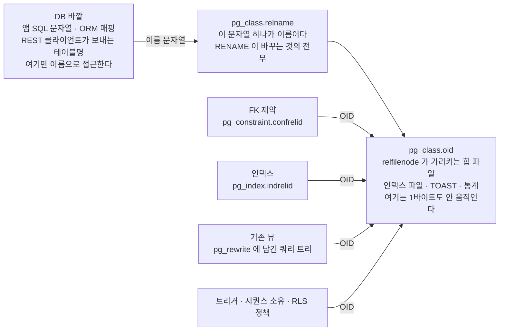
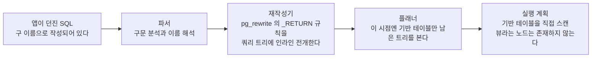

테이블 개명은 시스템 카탈로그의 문자열 하나를 바꾸는 일이다 — 데이터도, FK 도, 인덱스도, 기존 뷰도 따라 움직이지 않는다.
<!--more-->

## 환경

- PostgreSQL 15.8
- PostgREST 기반 자동 REST API — 테이블명이 URL 과 클라이언트 SDK 에 **문자열로** 박힌다
- 하나의 DB 를 8개 이상의 독립 서비스(백엔드 API, 크론 워커, 봇, 프론트 클라이언트)가 **같은 DB 롤로** 직접 읽고 쓴다
- 파이썬 백엔드 + JS 클라이언트 혼재

## 문제 상황

레거시 네이밍으로 굳어버린 테이블 45개가량을 새 이름 체계로 정리해야 했다.

막힌 지점은 개명 자체가 아니었다. **개명하는 순간에 무엇이 깨지는지 아무도 자신 있게 말하지 못한다는 것**이었다. 질문은 세 개였다.

- FK 제약, 인덱스, 트리거, 그 테이블을 참조하는 기존 뷰가 있다. **개명하면 이것들이 끊어지나?**
- 여러 서비스가 같은 테이블을 직접 쓴다. **전부 동시에 배포해야 하나?**
- 수백만 행짜리 테이블이 여럿이다. **데이터 복사를 감당할 수 있나?**

세 질문 모두 "모르니까 최악을 가정하자"로 흘렀고, 그래서 기본안은 **전면 병행**이었다. 새 이름의 테이블을 신설하고, dual-write 트리거를 걸고, 전량 backfill 하고, 검증 기간을 둔 뒤 구 테이블을 드롭한다. 안전해 보이는 계획이었다.

여기에 리스크 하나가 더 붙어 있었다. 구 이름을 뷰로 남겨 흡수하는 안을 검토하다가, **"`INSERT … ON CONFLICT`(upsert)는 뷰에서 지원되지 않는다"** 는 통념 때문에 그 안을 위험 항목으로 문서에까지 적었다. upsert 는 여러 서비스의 쓰기 경로에 흩어져 있어서, 사실이라면 코드 수정 범위가 확 늘어나는 조건이었다.

결과부터 쓰면 **그 통념은 틀렸고**, 확인하는 데 5분이 걸렸다. 그 얘기는 「[통념을 뒤집는 데 5분이 걸렸다](#통념을-뒤집는-데-5분이-걸렸다)」에서 한다.

## 재현

먼저 확인해야 할 것은 "개명이 DB 안의 의존 객체를 끊는가"다. 임시 객체 세 줄이면 답이 나온다.

```sql
CREATE TEMP TABLE tb_user_mst (id int PRIMARY KEY, name text);
CREATE TEMP VIEW v_active_user AS SELECT id, name FROM tb_user_mst;

ALTER TABLE tb_user_mst RENAME TO users;

SELECT * FROM v_active_user;      -- 정상 동작한다
SELECT pg_get_viewdef('v_active_user'::regclass, true);
```

마지막 줄이 돌려주는 정의는 이렇다.

```sql
 SELECT users.id,
    users.name
   FROM users;
```

**아무도 뷰 정의를 고치지 않았는데 신 이름으로 바뀌어 있다.** 뷰가 이름을 따라간 게 아니라, 애초에 이름을 저장한 적이 없기 때문이다.

## 원인

PostgreSQL 에서 `ALTER TABLE … RENAME TO …` 가 하는 일은 정확히 하나다. **시스템 카탈로그 `pg_class` 행의 `relname` 컬럼 값을 바꾼다.** 그게 전부다.

테이블의 실체 — 힙 파일, 인덱스 파일, TOAST, 통계 — 는 `pg_class.oid` 로 식별된다. 디스크 위의 파일명조차 `relfilenode` 라는 숫자라서 테이블 이름과 아무 관계가 없다. 그래서 **데이터는 0바이트 이동하고, 리라이트도 없다.** 수백만 행이든 수십억 행이든 개명 비용은 동일하다.

DB 안에서 그 테이블에 물려 있는 것들도 전부 이름이 아니라 OID 로 걸려 있다. `pg_depend` 가 의존성을 추적하는 단위 자체가 OID 쌍이다.



그림의 화살표 방향이 요점이다. 왼쪽 아래 네 갈래는 전부 **실체(OID)** 를 가리키고, 이름 라벨을 거치지 않는다. 위쪽 라벨의 문자열을 바꿔도 저 화살표들은 픽셀 하나 움직이지 않는다.

특히 헷갈리기 쉬운 게 뷰다. **뷰 정의는 SQL 텍스트로 저장되지 않는다.** `CREATE VIEW` 시점에 파싱을 마친 **쿼리 트리**가 `pg_rewrite` 에 들어가고, 그 트리 안의 테이블 참조도 OID다. `pg_get_viewdef()` 가 보여주는 SQL 은 저장된 원문이 아니라 **그 트리를 지금 시점의 카탈로그로 역출력한 결과**다. 그래서 기반 테이블을 개명하면 뷰 정의가 "자동으로 갱신된" 것처럼 보인다. 실제로는 갱신될 것이 처음부터 없었다.

여기서 결론이 하나 떨어진다. **개명으로 깨질 수 있는 것은 DB 바깥에서 이름 문자열로 접근하는 것뿐이다.**

- 앱 코드 안의 SQL 문자열
- ORM 의 테이블 매핑
- PostgREST 클라이언트가 URL 로 보내는 테이블명
- 함수 본문에 문자열로 박힌 동적 SQL (`EXECUTE format(...)`)

DB 안쪽은 알아서 따라온다. 문제는 정확히 **DB 바깥 한 겹**이고, 그 한 겹만 어떻게 흡수하느냐의 문제로 좁혀진다.

## 해결

**`RENAME` 과 구 이름 뷰 별칭을 한 트랜잭션 안에서** 처리한다.

```sql
BEGIN;
SET LOCAL lock_timeout = '2s';
ALTER TABLE tb_user_mst RENAME TO users;
CREATE VIEW tb_user_mst AS SELECT * FROM users;
COMMIT;
```

네 줄이 각각 일을 한다.

**1. `SELECT *` 한 줄짜리 뷰는 자동으로 쓰기가 된다.** PostgreSQL 9.3+ 의 auto-updatable view 다. `INSTEAD OF` 트리거 없이도 `INSERT`/`UPDATE`/`DELETE` 가 통한다. 조건이 붙지만 — FROM 에 릴레이션 하나, `DISTINCT`·`GROUP BY`·`HAVING`·집계·윈도우·`LIMIT`/`OFFSET`·`UNION` 없음, SELECT 목록이 기반 컬럼의 단순 참조일 것 — **"구조가 같은 개명"은 `SELECT *` 한 줄로 조건을 전부 만족한다.** 개명은 auto-updatable view 가 다룰 수 있는 가장 쉬운 형태다.

**2. 읽기 오버헤드가 사실상 0이다.** 뷰는 별도의 실행 노드가 아니라 재작성 단계에서 인라인 전개되는 규칙이다. 자세한 건 아래 [관련 이론](#쿼리-재작성기가-하는-일)에서 다룬다.

**3. DDL 이 트랜잭셔널이다.** `RENAME` 과 `CREATE VIEW` 를 한 트랜잭션에 묶으면 **"구 이름도 신 이름도 존재하지 않는 순간"이 외부에 절대 노출되지 않는다.** 커밋 전까지 다른 세션에는 구 이름 테이블이 그대로 보이고, 커밋 이후에는 구 이름 뷰와 신 이름 테이블이 동시에 보인다. 중간 상태가 없다.

**4. `lock_timeout` 이 유일한 운영 리스크를 막는다.** `RENAME` 과 `CREATE VIEW` 는 `ACCESS EXCLUSIVE` 락을 잡는다. 연산 자체는 밀리초로 끝나지만, 긴 트랜잭션이 그 테이블을 붙잡고 있으면 마이그레이션이 락 대기 큐에 서고 **그 뒤에 도착한 모든 쿼리가 — `SELECT` 까지 포함해서 — 함께 막힌다.** 밀리초짜리 DDL 이 장애처럼 보이는 경로가 이거다. `lock_timeout` 을 걸면 락을 못 잡았을 때 마이그레이션만 실패하고 서비스는 무사하다. 재시도하면 된다.

배포 순서 얘기가 사라진다는 게 실질적인 이득이다. 여덟 개 서비스는 구 이름으로 계속 요청하고, 뷰가 그걸 받아 기반 테이블로 넘긴다. 각 서비스는 **각자의 일정으로** 신 이름으로 갈아타면 되고, 다 갈아탄 뒤에 뷰를 걷는다.

### 고려했다 버린 대안 — 전면 병행

신설 + dual-write 트리거 + backfill + 검증 + cutover. 버린 이유는 셋이다.

- **구조가 동일한 데이터를 수백만 행 복사한다.** RENAME 은 데이터 이동이 0이다. 같은 결과를 얻는 데 비용 차이가 무한대다.
- **병행 기간 내내 모든 쓰기 경로에 트리거가 살아 있어야 한다.** 그것도 독립적으로 배포되는 여러 서비스에서. 뷰 별칭은 그 서비스들의 코드를 **한 줄도 고치지 않고** 흡수한다.
- **안전해 보이는 쪽이 실제로는 움직이는 부품이 훨씬 많다.** 전면 병행은 신 테이블, 트리거, 백필 잡, 정합성 검증, cutover 조율까지 다섯 개의 부품이 각각 실패할 수 있다. RENAME + 뷰는 부품이 두 개고 둘 다 한 트랜잭션 안에 있다.

세 번째가 이 글에서 가장 중요한 지점이다. **"안전"과 "안전해 보임"은 자주 반대 방향을 가리킨다.**

## 관련 이론

근본 원리는 한 문장이다. **카탈로그가 객체를 식별하는 키는 이름이 아니라 OID 다.** 이름은 사람이 읽는 라벨이고, 라벨을 바꾸는 것은 실체를 건드리지 않는다.

이 문장이 왜 참인지, 그리고 어디까지만 참인지를 아래에서 층층이 풀어 본다.

### 쿼리 재작성기가 하는 일

"뷰를 한 겹 끼우면 느려지지 않나"라는 질문에 답하려면 뷰가 실행되는 위치를 봐야 한다. 답은 **실행되지 않는다**이다.



뷰는 `pg_rewrite` 에 저장된 `_RETURN` 규칙이고, 재작성 단계에서 쿼리 트리 안으로 펼쳐진다. 플래너가 그 트리를 받을 때는 이미 기반 테이블만 남아 있다. 그래서 실행 계획에는 "뷰"라는 노드가 아예 없고, 기반 테이블을 직접 스캔하는 계획이 나온다. **오버헤드가 작은 게 아니라 오버헤드를 낼 자리가 없다.**

쓰기도 같은 자리에서 처리된다. 재작성기가 문장의 **대상 릴레이션을 뷰에서 기반 테이블로 치환**한다. 그래서 기반 테이블의 제약·트리거·RLS 가 그대로 적용되고, `RETURNING` 도 정상 동작한다. 우회로가 생기는 게 아니라, 문장이 원래 기반 테이블을 향했던 것처럼 다시 쓰이는 것이다.

아래 그림이 그 치환이 일어나는 자리를 표시한 것이다. **왼쪽 레일의 색이 바뀌는 한 지점**만 보면 된다 — 구 이름 뷰에 던진 문장이 그 지점에 닿기도 전에 떨어지는지, 지점을 넘어 기반 테이블 스캔까지 그대로 가는지가 거기서 갈린다.



### 구 이름 뷰에 무엇을 던질 수 있나

아래는 PostgreSQL 15.8 에서 실제로 돌려 얻은 결과다.

| SQL 문장 | 기반 테이블 직접 | 구 이름 뷰 (auto-updatable) |
|---|---|---|
| `SELECT` | 동작 | 동작 (계획에 뷰 노드 없음) |
| `INSERT` | 동작 | 동작 |
| `INSERT … RETURNING` | 동작 | 동작 |
| `UPDATE` | 동작 | 동작 |
| `DELETE` | 동작 | 동작 |
| `INSERT … ON CONFLICT (컬럼) DO NOTHING` | 동작 | **동작** |
| `INSERT … ON CONFLICT (컬럼) DO UPDATE` | 동작 | **동작** |
| `INSERT … ON CONFLICT ON CONSTRAINT 제약명` | 동작 | **실패** — `42704`, 그 제약이 뷰에는 없다 |
| `TRUNCATE` | 동작 | **실패** — `42809`, is not a table |
| `COPY … FROM` | 동작 | **실패(추정)** — 아래 「검증하지 못한 것」 참고 |
| 기반 테이블에 `ADD COLUMN` 후 `SELECT *` | 신 컬럼 보임 | **신 컬럼 안 보임** |
| 뷰가 참조 중인 컬럼을 `DROP COLUMN` | **실패** — `2BP01`, 의존 객체가 있다 | (해당 없음) |
| 기반 테이블 `RENAME` 후 뷰 조회 | (해당 없음) | 동작 + 뷰 정의가 신 이름으로 재출력 |

실무에서 중요한 결론은 짧다. **막히는 건 세 개뿐이고, 그중 upsert 는 컬럼 추론을 쓰는 한 막히지 않는다.**

`SELECT *` 뷰가 신 컬럼을 못 보는 건 실패는 아니지만 조용해서 더 위험하다. `CREATE VIEW … AS SELECT *` 는 **생성 시점의 컬럼 목록으로 고정**된다 — `*` 가 그때 전개되어 트리에 박히기 때문이다. 뷰 별칭이 살아 있는 동안 기반 테이블에 컬럼을 추가하면, 구 이름으로 접근하는 서비스에는 그 컬럼이 존재하지 않는다. 별칭 기간 중 컬럼을 추가한다면 뷰도 같이 다시 만들어야 한다.

### 통념을 뒤집는 데 5분이 걸렸다

앞에서 적은 대로, 나는 "뷰에서는 upsert 가 안 된다"고 믿고 있었고 그걸 이 마이그레이션의 최대 리스크로 문서에 적었다. 확인은 이게 전부였다.

```sql
CREATE TEMP TABLE users (id int PRIMARY KEY, name text);
CREATE TEMP VIEW tb_user_mst AS SELECT * FROM users;

INSERT INTO tb_user_mst (id, name) VALUES (1, 'a')
  ON CONFLICT (id) DO NOTHING;                              -- 동작

INSERT INTO tb_user_mst (id, name) VALUES (1, 'b')
  ON CONFLICT (id) DO UPDATE SET name = excluded.name;      -- 동작

INSERT INTO tb_user_mst (id, name) VALUES (1, 'c')
  ON CONFLICT ON CONSTRAINT users_pkey DO NOTHING;          -- 42704
```

**컬럼 추론 방식은 둘 다 정상 동작했다.** 실패한 것은 제약 이름으로 추론하는 형태뿐이었다.

이유는 원리를 따라가면 자명하다. `ON CONFLICT (id)` 는 **대상 릴레이션의 컬럼**으로 유니크 인덱스를 추론하고, 그 추론은 재작성기가 대상을 기반 테이블로 치환한 뒤에 그 테이블 위에서 이뤄진다. 반면 `ON CONFLICT ON CONSTRAINT users_pkey` 는 **문장에 적힌 릴레이션에서 그 이름의 제약을 찾는다.** 제약은 기반 테이블에 붙어 있고 뷰에는 붙어 있지 않으니, 존재하지 않는 이름을 찾다가 `42704` 로 끝난다. 뷰가 upsert 를 못 하는 게 아니라, **뷰에 없는 것의 이름을 부른 것**이다.

교훈이 두 개 나왔다.

**하나. 검증 비용이 이렇게 싼데 통념으로 설계 결정을 내릴 이유가 없다.** PostgreSQL 은 DDL 이 트랜잭셔널이고 임시 테이블·임시 뷰는 세션이 끝나면 사라진다. 위 다섯 줄은 운영 DB 를 건드리지 않고, 롤백하면 흔적도 남지 않는다. 문서를 뒤지고 기억을 더듬는 시간이 실행해 보는 시간보다 길다.

**둘. 과대 평가된 리스크도 리스크다.** 저 착오는 나를 안전한 쪽으로 밀어준 게 아니라, **하지 않아도 될 코드 수정과 일정을 만들어냈다.** 있지도 않은 제약을 피하려고 설계를 비틀면, 비튼 만큼의 복잡도는 실제로 생긴다. 리스크 평가가 틀린 방향은 두 개이고, 둘 다 비용을 만든다.

### 헷갈리는 짝들

이름이 비슷하거나 같은 범주로 묶여서 오해를 부르는 지점들이다.

| A | B | 차이 |
|---|---|---|
| 뷰 정의가 SQL 텍스트로 저장된다 (오해) | 파싱된 쿼리 트리로 `pg_rewrite` 에 저장된다 (사실) | 그래서 기반 테이블을 개명하면 뷰가 자동으로 따라간다 |
| auto-updatable view | `INSTEAD OF` 트리거 뷰 | 전자는 **재작성기가 대상 릴레이션을 치환**하고, 후자는 **트리거 본문이 대신 실행**된다. 지원되는 문장 종류가 다르다 |
| `ON CONFLICT (컬럼)` | `ON CONFLICT ON CONSTRAINT 제약명` | 전자는 컬럼으로 인덱스를 추론하고, 후자는 이름으로 제약을 찾는다. 뷰에서 전자는 되고 후자는 안 된다 |
| `DROP COLUMN` 이 거부되는 것 = 불편 | = 안전판 | 잔존 참조를 조용한 오동작 대신 **시끄러운 에러**로 바꿔준다 |

마지막 줄은 뷰를 걷는 단계에서 실제로 쓰는 장치다. 아래에서 이어서 다룬다.

### 이 해법이 못 하는 것과, 그걸 맡는 층위

뷰 별칭은 만능이 아니다. 중요한 건 각 구멍을 **어느 층이 막느냐**를 미리 정해 두는 것이다.

| 구멍 | 뷰가 막아주나 | 맡는 층 |
|---|---|---|
| 앱 SQL 문자열에 남은 구 이름 | 막아준다 (그게 목적이다) | — |
| 신 이름으로 갈아탈 때의 누락 | ✕ | 코드 층의 grep, 그리고 뷰를 걷는 순서 |
| RLS 정책이 걸린 테이블 | ✕ | `security_invoker = true` |
| 락 대기로 인한 연쇄 정지 | ✕ | `lock_timeout` |
| 뷰를 걷을 때 남은 잔존 참조 | ✕ | `DROP COLUMN` 의 의존성 검사 |

**RLS 는 반드시 짚어야 한다.** 기본 뷰는 **뷰 소유자의 권한으로** 평가된다. 즉 기반 테이블에 걸린 RLS 정책이 호출자 기준으로 걸리지 않는다. 개명 전에는 행 단위로 걸러지던 것이 뷰를 거치면 전부 보이는 상태가 될 수 있다. PostgreSQL 15+ 에는 이걸 위한 옵션이 있다.

```sql
CREATE VIEW tb_user_mst WITH (security_invoker = true) AS SELECT * FROM users;
```

RLS 를 쓰는 테이블이 하나라도 있으면, 이 옵션은 선택이 아니라 필수다. 개명은 무해한 작업으로 분류되기 쉬워서 **보안 경계가 조용히 넓어지는 것**을 놓치기 쉽다.

**뷰를 걷는 순서**에도 장치가 하나 있다. 뷰가 참조하는 컬럼은 `CASCADE` 없이 `DROP COLUMN` 이 거부된다(`2BP01`). 이걸 순서로 뒤집어 쓴다.

1. 뷰 별칭의 SELECT 목록에서 그 컬럼을 **먼저 뺀다** (뷰를 다시 만든다)
2. 그 상태로 잠시 둔다 — 구 이름으로 그 컬럼을 읽던 코드가 남아 있으면 여기서 에러가 난다
3. 조용하면 실 컬럼을 드롭한다

이러면 잔존 참조가 조용한 오동작이 아니라 **에러로 강제 노출**된다. 거부되는 제약을 불편으로 볼지 안전판으로 볼지는 순서를 어떻게 짜느냐에 달려 있다.

### 검증하지 못한 것

정직하게 남긴다.

- **`COPY … FROM <뷰>`** — 직접 확인하려 했으나 파일 읽기 권한 에러가 먼저 발생해 검증하지 못했다. 공식 문서상 `COPY FROM` 은 **`INSTEAD OF INSERT` 트리거가 있는 뷰**에서만 가능하므로 auto-updatable 뷰에서는 실패할 것으로 본다. **문서 근거, 미검증이다.**
- **`INSTEAD OF` 트리거가 붙은 뷰에서의 `ON CONFLICT` 동작** — 테스트하지 않았다. 확인하지 않았으므로 아무것도 주장하지 않는다.

### 일반화 — expand / contract

이 작업은 스키마 마이그레이션의 일반 패턴 하나에 정확히 들어맞는다. **expand / contract**(= parallel change) 라고 부른다.

| 단계 | 하는 일 | 원칙 |
|---|---|---|
| expand | 신 구조를 **추가**한다. 구 구조는 그대로 둔다 | **additive 만** — 컬럼 추가, 인덱스 추가는 기존 읽기·쓰기를 깨지 않는다 |
| migrate | 읽는 쪽·쓰는 쪽을 하나씩 신 구조로 옮긴다 | 서비스마다 **각자의 일정**으로 |
| contract | 구 구조를 **드롭**한다 | **최후에.** 되돌릴 수 없는 유일한 단계 |

이 글의 해법을 이 표에 얹으면 이렇게 된다. `RENAME` + 뷰 생성이 expand, 각 서비스의 코드 교체가 migrate, 뷰를 걷는 것이 contract 다. 특이한 점은 **expand 단계의 비용이 0**이라는 것이다 — 보통 expand 는 새 컬럼을 만들고 백필하는 비용을 치르는데, 개명은 구조가 동일하므로 카탈로그 한 줄과 뷰 하나면 끝난다.

의미가 바뀌는 변경은 사정이 다르다. 컬럼의 **뜻**을 바꾸는 것(단위 변경, 타입 변경, 값 체계 변경)은 절대 제자리에서 하면 안 된다. 신 컬럼 병행 → 백필 → 읽기 전환 → 쓰기 전환 → 구 컬럼 드롭 순서를 밟아야 한다. 개명이 쉬운 이유는 **의미가 바뀌지 않기 때문**이지, 마이그레이션 일반이 쉬워서가 아니다.

### 간접 계층을 한 겹 끼운다는 것

마지막으로 한 층 더 올라가면, 이 해법은 DB 만의 것이 아니다.

**"이름이 바뀌는 지점에 간접 계층을 한 겹 끼워 넣어 변경을 흡수한다"** 는 구조는 도처에 있다.

| 도메인 | 간접 계층 | 흡수하는 것 |
|---|---|---|
| DB | 구 이름 뷰 | 테이블 개명 |
| HTTP | 301 리다이렉트 | URL 변경 |
| 파일시스템 | 심볼릭 링크 | 경로 변경 |
| API | 버전 라우팅 | 계약 변경 |
| DNS | CNAME | 호스트 변경 |

전부 같은 성질을 공유한다. **간접 계층은 공짜가 아니라 외상이다.** 걷어야 끝나고, 안 걷으면 영구 부채가 된다. 뷰 별칭도 마찬가지다 — "임시"라고 부르는 순간 언제까지가 임시인지 정해야 한다. 위의 `DROP COLUMN` 순서 장치는 그 외상을 갚을 때 잔액을 정확히 세기 위한 것이다.

그리고 다섯 줄 모두, 간접 계층이 성립하는 조건은 하나로 같다. **바뀌는 것이 이름뿐이고 실체는 그대로일 것.** 실체가 바뀌면 리다이렉트도 심볼릭 링크도 뷰도 거짓말이 된다.

## 참고

- [PostgreSQL — ALTER TABLE](https://www.postgresql.org/docs/15/sql-altertable.html)
- [PostgreSQL — CREATE VIEW (Updatable Views)](https://www.postgresql.org/docs/15/sql-createview.html)
- [PostgreSQL — The Rule System](https://www.postgresql.org/docs/15/rules.html)
- [PostgreSQL — INSERT ... ON CONFLICT](https://www.postgresql.org/docs/15/sql-insert.html)
- [PostgreSQL — pg_class](https://www.postgresql.org/docs/15/catalog-pg-class.html)
- [PostgreSQL — Row Security Policies](https://www.postgresql.org/docs/15/ddl-rowsecurity.html)
