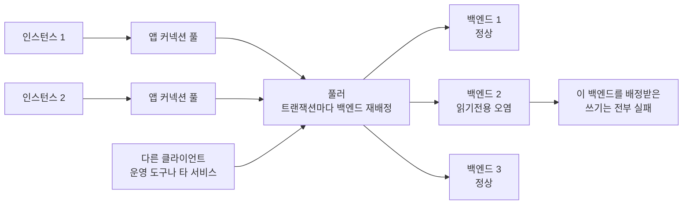

`SET default_transaction_read_only = true` 는 자기 트랜잭션을 막지 못하고, 대신 커넥션에 남아 남의 트랜잭션을 죽인다.
<!--more-->

## 환경

- PostgreSQL 15
- SQLAlchemy 2.x + psycopg2, 애플리케이션 레벨 커넥션 풀
- 그 앞단에 **transaction pooling 모드로 동작하는 커넥션 풀러** (PgBouncer 계열)

## 문제 상황

쓰기 요청이 **간헐적으로** 500 을 뱉었다. 에러는 한 종류였다.

```
psycopg2.errors.ReadOnlySqlTransaction:
  cannot execute SELECT FOR UPDATE in a read-only transaction
```

이상한 점이 여러 개였다.

- **DB 는 읽기전용이 아니었다.** 데이터베이스·롤 레벨 `default_transaction_read_only` 설정이 없었고, 같은 시각 배치 작업들은 정상적으로 쓰고 있었다.
- **재시도하면 성공하기도 했다.** 같은 요청을 다시 보내면 되는 경우가 있었다.
- **관리 콘솔로 확인하면 정상이었다.** 접속해서 `current_setting('default_transaction_read_only')` 를 찍으면 `off` 가 나왔다.

세 번째가 가장 오래 붙잡았다. "DB 는 멀쩡한데 앱만 읽기전용"이라는 모순처럼 보였는데, 실은 **잘못된 곳을 보고 있었다.**

## 재현

두 부분으로 나뉜다. 먼저 **가드가 동작하지 않는다**는 것부터.

```python
from sqlalchemy import create_engine, text

engine = create_engine(DSN)

with engine.connect() as conn:
    conn.execute(text("SET default_transaction_read_only = true"))
    # 읽기전용이어야 하는데...
    conn.execute(text("CREATE TEMP TABLE t (x int)"))   # ✅ 통과한다
    conn.commit()
```

쓰기가 막힐 거라 기대한 자리에서 아무 일도 일어나지 않는다. 그리고 **커넥션을 반납한 뒤**:

```python
with engine.connect() as conn:          # 같은 커넥션을 다시 꺼낸다
    conn.execute(text("CREATE TEMP TABLE t2 (x int)"))
    # psycopg2.errors.ReadOnlySqlTransaction
```

막으려던 곳은 안 막히고, 상관없는 다음 작업이 죽는다. **정확히 반대로 동작한다.**

## 원인

읽기전용 세션을 만들어 주는 헬퍼가 있었다. 대략 이런 모양이었다.

```python
@contextmanager
def readonly_session():
    session = SessionLocal()
    try:
        session.execute(text("SET statement_timeout = '10000'"))
        session.execute(text("SET default_transaction_read_only = true"))
        yield session
    finally:
        session.close()
```

여기에 **두 개의 버그가 겹쳐 있었다.**

### 1. 가드가 자기 트랜잭션을 막지 못한다

`default_transaction_read_only` 는 이름 그대로 **기본값**이다. 트랜잭션이 *시작될 때* 실제 플래그인 `transaction_read_only` 의 초깃값으로 복사된다.

그런데 위 코드에서 `session.execute()` 는 첫 호출에서 이미 트랜잭션을 연다. 즉 `SET` 이 실행되는 시점에는 **트랜잭션이 이미 시작된 뒤**다. 기본값을 바꿔봐야 이번 트랜잭션의 `transaction_read_only` 는 그대로 `off` 다.

이 헬퍼는 읽기전용 가드로 4개월간 쓰였지만, 실제로는 **한 번도 아무것도 막은 적이 없었다.**

### 2. 그 SET 이 커넥션에 남는다

`SET` 은 **세션 레벨**이다. 트랜잭션이 끝나도 커넥션이 살아 있는 한 값이 유지된다. 그래서 이 커넥션이 풀에 반납되고 다른 요청이 꺼내 쓰면, 그 요청의 트랜잭션은 시작하자마자 `transaction_read_only = on` 을 물려받는다.

여기에 **풀러의 transaction pooling** 이 겹치면 피해가 앱 밖으로 번진다. 이 모드에서 서버 백엔드는 트랜잭션 단위로 여러 클라이언트에게 돌려 쓰인다. 한 백엔드가 오염되면 그걸 배정받은 모든 클라이언트가 읽기전용 트랜잭션을 받는다.



간헐적이었던 이유가 이거다. **오염된 백엔드에 배정될 때만** 실패한다. 재시도하면 다른 백엔드로 가서 성공한다.

## 해결

`SET` 을 트랜잭션 스코프로 내린다.

```python
@contextmanager
def readonly_session():
    session = SessionLocal()
    try:
        session.execute(text("SET TRANSACTION READ ONLY"))          # 현재 트랜잭션에 즉시 적용
        session.execute(text("SET LOCAL statement_timeout = '10000'"))
        yield session
    finally:
        session.close()
```

- `SET TRANSACTION READ ONLY` 는 **기본값이 아니라 현재 트랜잭션의 플래그를 직접** 바꾼다. 그래서 이번 트랜잭션이 진짜로 읽기전용이 된다.
- 트랜잭션이 끝나면 자동으로 사라진다. 커넥션에 아무것도 남지 않는다.
- `SET LOCAL` 도 같은 이유로 안전하다. 트랜잭션 종료 시 되돌아간다.

`SET TRANSACTION` 은 **트랜잭션의 첫 쿼리보다 먼저** 나와야 한다. `SET`/`SET LOCAL` 같은 유틸리티 명령은 "쿼리"로 치지 않으므로 그 뒤에 와도 되지만, 순서를 헷갈릴 이유가 없으니 맨 앞에 둔다.

### 고려했다 버린 대안

**`SET LOCAL default_transaction_read_only = true`** — 커넥션 오염은 막지만 **가드는 여전히 무동작이다.** 이미 시작된 트랜잭션의 기본값을 바꾸는 것뿐이라 아무것도 막지 못한다. 누수만 고치고 원래 의도는 놓친다.

**풀 반납 시점에 `DISCARD ALL` 을 거는 것** — 모든 세션 상태를 초기화하니 확실하다. 하지만 커넥션을 돌려줄 때마다 왕복이 한 번씩 더 붙는다. 오염원이 코드 안에 있고 그게 두 줄이면, 두 줄을 고치는 게 맞다.

## 관련 이론

아래 시뮬레이터가 이 글의 요약이다. **✕ 마커가 어디에 꽂히는지**만 보면 된다 — 막으려던 트랜잭션에 꽂히는지, 상관없는 다음 트랜잭션에 꽂히는지, 아니면 아무 데도 안 꽂히는지.



`SET default_transaction_read_only` 는 **커밋했을 때만** 다음 트랜잭션을 죽인다. 롤백하면 아무 일도 없었던 것처럼 사라진다 — 그래서 이 버그는 평소엔 조용하다가 특정 경로에서만 터진다.

### GUC 는 네 층으로 겹쳐 있다

PostgreSQL 의 설정값(GUC)은 좁은 층이 넓은 층을 덮어쓴다.

| 층 | 거는 법 | 사는 기간 |
|---|---|---|
| 서버 | `postgresql.conf` | 프로세스 수명 |
| 데이터베이스 / 롤 | `ALTER DATABASE … SET`, `ALTER ROLE … SET` | 영구 (다음 접속부터) |
| **세션** | `SET x = v` | **커넥션이 끊길 때까지** |
| **트랜잭션** | `SET LOCAL x = v` | **트랜잭션 종료까지** |

커넥션 풀은 이 표의 "세션" 층을 **재사용 가능한 자원**으로 만든다. 세션이 요청보다 오래 살기 때문에, 요청이 세션에 남긴 것은 다음 요청의 초기 조건이 된다. 풀을 쓰는 순간 `SET` 은 지역 변수가 아니라 **전역 변수**가 된다.

### `SET` 은 트랜잭션적이다

의외로 덜 알려진 사실 하나. `SET` 은 트랜잭션 안에서 실행되면 **롤백 대상이다.**

```sql
BEGIN;
SET default_transaction_read_only = true;
ROLLBACK;
-- 값은 off 로 돌아간다
```

이건 좋은 소식이자 나쁜 소식이다. 좋은 쪽으로는, 예외로 롤백된 경로는 커넥션을 오염시키지 않는다. 나쁜 쪽으로는 — **버그가 간헐적이 된다.** 커밋한 경로에서만 값이 남으니, 재현을 시도하다 롤백 경로만 밟으면 "재현 안 되는데?" 로 끝난다.

실제로 이 사건에서도 롤백 경로로 재현을 시도했다가 한 번 헛짚었다.

### `default_transaction_read_only` 와 `transaction_read_only` 는 다른 값이다

이름이 비슷해서 같은 것처럼 읽히지만 역할이 완전히 다르다.

- `transaction_read_only` — **지금 이 트랜잭션**이 읽기전용인가. 실제로 쓰기를 거부하는 건 이 값이다.
- `default_transaction_read_only` — 트랜잭션이 시작될 때 위 값에 **복사되는 초깃값**.

그래서 트랜잭션이 시작된 뒤에 `default_…` 를 바꾸면 **이번 트랜잭션에는 아무 영향이 없다.** 다음 트랜잭션부터 적용된다. 이름에 `default` 가 붙어 있는데도 이걸 "지금 읽기전용으로 만드는 스위치"로 읽기 쉽다.

### 네 가지를 한 줄로 구분하기

| 구문 | 현재 트랜잭션 | 커넥션에 남나 |
|---|---|---|
| `SET default_transaction_read_only = on` | ❌ 영향 없음 | ⚠️ 커밋하면 남는다 |
| `SET LOCAL default_transaction_read_only = on` | ❌ 영향 없음 | ✅ 안 남는다 |
| **`SET TRANSACTION READ ONLY`** | ✅ **즉시 적용** | ✅ 안 남는다 |
| `SET SESSION CHARACTERISTICS AS TRANSACTION READ ONLY` | ❌ 영향 없음 | ⚠️ 커밋하면 남는다 |

원하는 게 "이 블록 안에서만 쓰기 금지"라면 답은 하나뿐이다. 나머지 셋은 **의도한 트랜잭션을 막지 못한다** — 위 두 개는 덤으로 커넥션까지 오염시킨다.

읽기전용 상태를 실제로 확인하고 싶다면 `default_…` 가 아니라 이쪽을 본다.

```sql
SELECT current_setting('transaction_read_only');
```

### transaction pooling 은 세션 상태를 공유한다

풀러의 pooling 모드는 "서버 백엔드를 언제 반납하느냐"의 차이다.

| 모드 | 반납 시점 | 세션 상태 |
|---|---|---|
| session | 클라이언트가 끊을 때 | 클라이언트 전용 |
| **transaction** | **트랜잭션이 끝날 때마다** | **여러 클라이언트가 공유** |
| statement | 쿼리마다 | 공유 (트랜잭션 불가) |

transaction 모드가 커넥션 효율이 가장 좋아서 기본으로 쓰이지만, 대가가 있다. **세션 상태는 클라이언트 것이 아니다.** prepared statement, 세션 레벨 `SET`, `LISTEN/NOTIFY`, 임시 테이블 — 전부 다음 클라이언트에게 흘러간다. PgBouncer 가 이 모드에서 세션 레벨 기능을 "쓰면 안 되는 것"으로 문서화하는 이유다.

그래서 **transaction pooling 을 쓰는 순간, 세션 레벨 `SET` 은 앱 안의 버그가 아니라 인프라 전체에 번지는 버그가 된다.** 오염된 백엔드 하나가 그걸 배정받는 모든 클라이언트를 물들인다.

### 오염은 프로세스 경계를 넘는다

애플리케이션 인스턴스를 여러 대 띄워 놓으면 이 버그의 성질이 한 번 더 바뀐다. **인스턴스 1 이 남긴 세션 상태가 인스턴스 2 의 트랜잭션을 죽인다.** 프로세스가 다르고 메모리를 한 톨도 공유하지 않는데도 그렇다.

각 인스턴스는 자기 애플리케이션 커넥션 풀을 갖는다. **거기까지는 섞이지 않는다** — 인스턴스 1 의 풀에 들어 있는 커넥션 객체를 인스턴스 2 가 꺼내 쓸 방법은 없다. 문제는 그 풀들이 전부 **같은 풀러 한 곳**으로 붙는다는 것이다. transaction pooling 은 서버 백엔드를 트랜잭션 단위로 반납받아 다음 요청에게 넘기는데, 그 "다음 요청"이 어느 인스턴스에서 왔는지는 풀러의 관심사가 아니다. 인스턴스 1 이 백엔드에 남긴 GUC 는 곧바로 인스턴스 2 의 트랜잭션에 상속된다.

**공유 지점은 애플리케이션 풀이 아니라 풀러 뒤의 서버 백엔드 풀이다.** 이 한 문장이 요점이다. 위 원인 절의 도식에서 화살표가 한 점으로 좁아지는 자리가 정확히 그 지점이고, 오염이 건너다니는 통로도 거기뿐이다.

그러니 인스턴스 대수는 이 버그의 **조건이 아니라 피해 범위**다. 한 대만 띄워도 그 안의 워커 스레드들이 같은 풀을 공유하므로 오염은 똑같이 번진다. 여러 대는 반경을 넓힐 뿐이다. 반대로 session pooling 이면 백엔드가 클라이언트 전용이라 — 위 pooling 모드 표의 첫 줄 — 이 전파는 **원천적으로 불가능하다.** 같은 코드, 같은 버그인데 풀러의 모드 한 줄이 "내 커넥션만 망가짐"과 "남의 인스턴스까지 망가짐"을 가른다.

다만 전파도 **커밋된 경로에서만** 일어난다. 앞에서 본 대로 `SET` 은 롤백 대상이라, 예외로 끝난 트랜잭션은 백엔드에 아무것도 남기지 않는다. 그래서 인스턴스가 아무리 많아도 이 버그는 결정론적으로 터지지 않고 여전히 확률적으로 나타난다 — 오염을 남기는 경로를 밟은 뒤, 그 백엔드를 배정받았을 때만.

운영에서 이게 걸리는 지점은 **배포**다. 인스턴스 중 **하나만 옛 코드로 남아 있어도 전체가 오염된다.** 롤링 배포가 도는 중이거나 한 배포 단위가 실수로 누락되면, 고친 인스턴스들이 안 고친 인스턴스의 피해를 그대로 받는다. 절반쯤 배포된 상태는 절반쯤 고쳐진 상태가 아니라 **안 고쳐진 상태**에 가깝다. 그래서 이런 수정은 같은 풀러를 쓰는 **모든 배포 단위에 동시에** 나가야 한다.

그리고 같은 풀러를 공유하는 것이 내 인스턴스들만이라는 보장도 없다. 위 도식의 세 번째 갈래 — 애플리케이션이 아닌 클라이언트 — 는 아래 「풀러 뒤에 모이는 것은 내 앱만이 아니다」에서 이어서 다룬다.

### 왜 진단이 어려운가 — GUC 는 밖에서 안 보인다

가장 오래 헤맨 지점이다. **다른 세션의 GUC 값을 조회할 방법이 없다.**

`pg_stat_activity` 에는 pid, state, query 는 있어도 그 백엔드의 설정값은 없다. `pg_settings` 는 언제나 **내 세션의 값**만 보여준다. 그래서 관리 콘솔로 붙어 `current_setting('default_transaction_read_only')` 를 찍으면 당연히 `off` 가 나온다 — 방금 만든 깨끗한 세션이니까.

오염을 관측하려면 **오염된 것과 같은 경로로 붙어야** 한다. 즉 풀러를 통해서.

한 가지 함정이 더 있다. **순차로 접속하면 표본이 편향된다.** 열고 닫기를 반복하면 풀러가 같은 백엔드를 계속 돌려주기 때문이다. 이 사건에서도 순차 관측으로 "오염률 50%" 가 나왔다가, 커넥션을 **동시에** 25개 붙잡고 다시 재니 실제로는 18% 였다.

```python
conns = [engine.connect() for _ in range(25)]     # 동시에 붙잡아야
for c in conns:                                   # 서로 다른 백엔드가 배정된다
    print(c.execute(text(
        "SELECT pg_backend_pid(), current_setting('default_transaction_read_only')"
    )).one())
```

### 풀러 뒤에 모이는 것은 내 앱만이 아니다

풀러 주소로 붙는 것은 종류와 상관없이 전부 같은 백엔드 풀을 나눠 쓴다. 애플리케이션 인스턴스만이 아니다. 사람이 손으로 쓰는 GUI DB 클라이언트, 다른 팀이 다른 저장소에서 배포한 서비스, 일회성 운영 스크립트와 마이그레이션 도구와 리포팅 잡 — 전부 같은 줄에 선다. 위 원인 절 도식의 세 번째 갈래가 그것이다. 이들 중 하나가 세션 레벨 `SET` 을 남기면 그 백엔드를 배정받는 **애플리케이션 요청**이 죽고, 반대 방향도 똑같이 성립한다. 코드 리뷰로도 배포 파이프라인으로도 막을 수 없는 경로다 — 애초에 내 저장소 밖에서 벌어지는 일이기 때문이다.

그리고 이건 눈에 보인다. **`application_name` 도 세션 상태다.** 그래서 GUC 와 정확히 같은 경로로 전파된다. 애플리케이션 커넥션으로 풀러에 붙어 자기 백엔드의 `application_name` 을 조회했더니 **설정한 적 없는 GUI DB 클라이언트의 이름과 버전**이 나왔다. 그 백엔드를 직전에 쓰던 클라이언트가 남긴 값이 지워지지 않고 그대로 상속된 것이다. 이 한 줄짜리 관측이 두 가지를 한 번에 증명한다 — 풀러는 백엔드를 넘길 때 **세션 상태를 초기화하지 않고**, 그 백엔드를 **전혀 다른 클라이언트와 공유하고 있다.**

그래서 `application_name` 은 이 문제의 리트머스지다. 오염된 GUC 는 앞 절에서 본 대로 밖에서 조회할 방법이 없지만, `application_name` 은 같은 세션 안에서 그냥 읽힌다.

```sql
SELECT current_setting('application_name'),
       current_setting('default_transaction_read_only');
```

애플리케이션에서 이걸 찍었을 때 첫 컬럼에 내가 설정하지 않은 낯선 값이 보이면, 그 커넥션은 남이 쓰던 세션을 물려받은 것이다. 즉 **GUC 도 똑같이 물려받을 수 있는 상태**라는 뜻이다. 둘째 컬럼이 마침 `off` 로 나왔다고 해서 안심할 근거는 되지 않는다.

여기서 실전 결론이 하나 나온다. **사람이 쓰는 도구는 풀러 모드를 분리하는 게 맞다.** transaction pooling 은 애플리케이션을 위한 것이다 — 커넥션 수를 아끼려고 세션 격리를 포기한 거래다. 반면 GUI 클라이언트나 일회성 운영 스크립트는 커넥션을 몇 개 쓰지 않으니 아낄 것이 없고, 세션 상태는 자유롭게 건드린다. 읽기전용 모드, 임시 테이블, 세션 변수 전부 사람 손끝에 있다. 얻는 것은 없고 잃는 것만 있는 거래다.

사람용 접속을 session pooling 쪽으로 분리하면 백엔드가 그 클라이언트 전용이 되어 — 위 pooling 모드 표의 첫 줄 — 무엇을 남기든 애플리케이션으로 새지 않는다. **코드 수정으로는 얻을 수 없는 종류의 안전장치다.** 접속 경로를 나누는 운영 결정이 그 자리를 대신한다.

### 이 해법의 한계

고친 것은 **"내 코드가 세션에 아무것도 남기지 않는다"** 까지다. 그 이상은 아니다.

transaction pooling 뒤의 백엔드는 여러 클라이언트가 공유한다. 같은 풀러를 쓰는 **다른 애플리케이션**이 세션 레벨 `SET` 을 남기면, 내 코드가 아무리 깨끗해도 오염된 백엔드를 배정받는다. 애플리케이션 코드로는 막을 수 없는 층위다.

그 층은 풀러가 맡는다 — 반납 시점의 `server_reset_query`(보통 `DISCARD ALL`) 가 그 방어선이다. transaction 모드에서는 성능 때문에 기본적으로 비어 있는 경우가 많으니, 여러 팀이 하나의 풀러를 공유한다면 이 설정을 확인해 둘 가치가 있다.

정리하면 방어는 두 겹이다. **코드는 세션에 남기지 않고, 풀러는 반납할 때 지운다.** 한 겹만 있으면 나머지 한 겹의 구멍으로 새어 나온다.

## 참고

- [PostgreSQL — SET TRANSACTION](https://www.postgresql.org/docs/15/sql-set-transaction.html)
- [PostgreSQL — SET](https://www.postgresql.org/docs/15/sql-set.html)
- [PgBouncer — pooling modes](https://www.pgbouncer.org/features.html)
