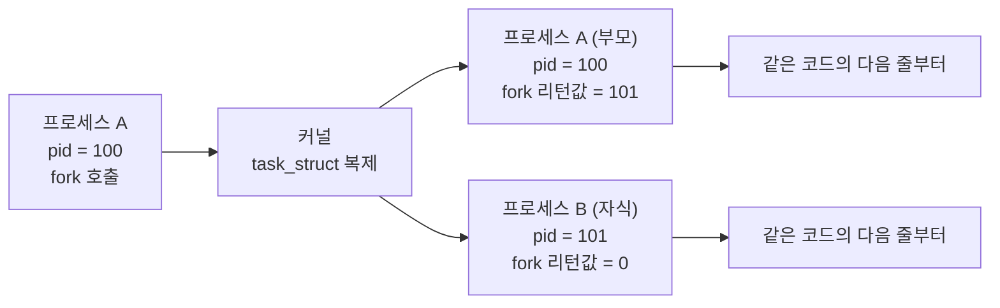
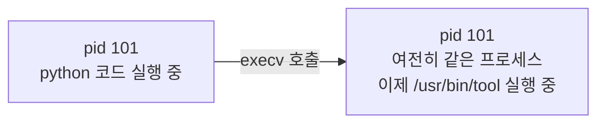
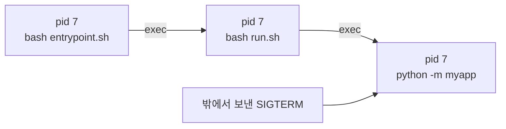
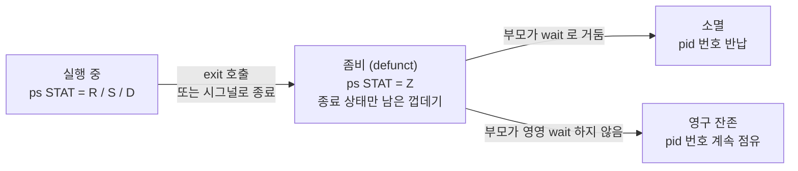
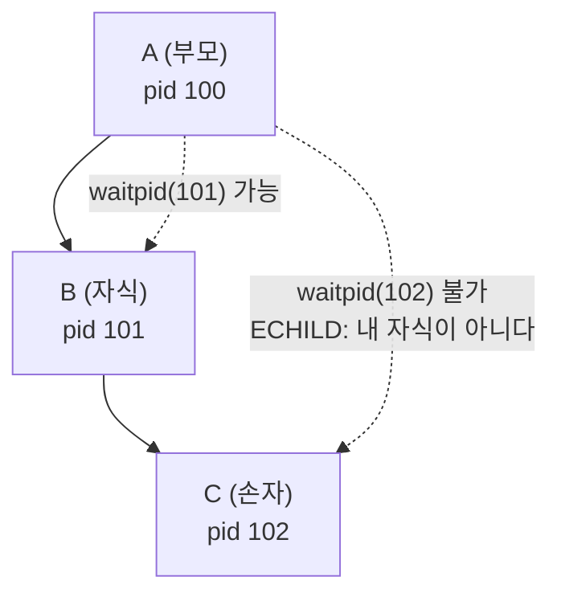
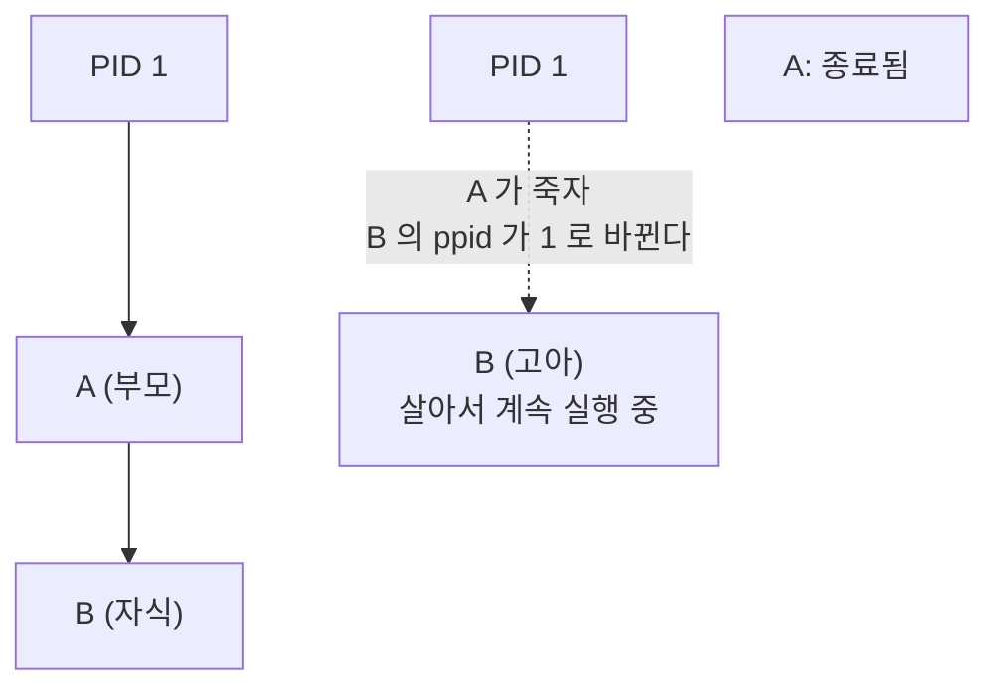
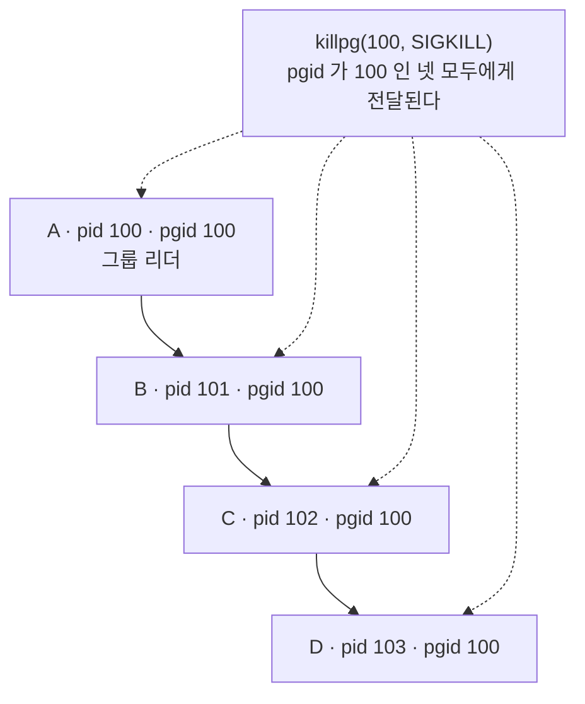
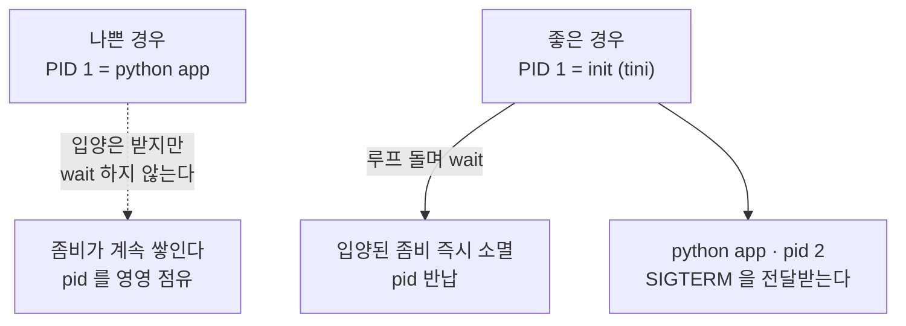
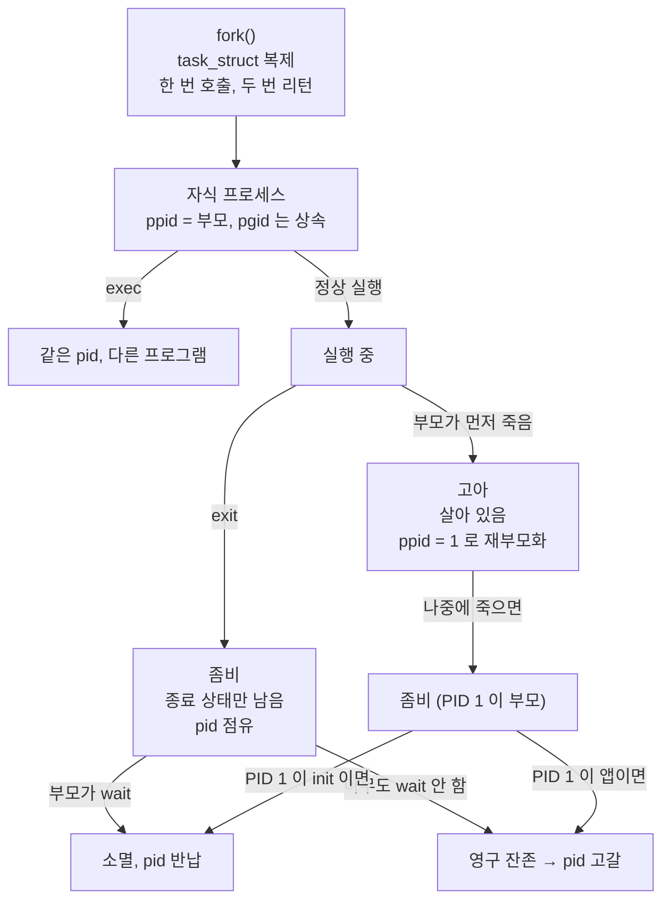

부모·자식·손자, 고아와 좀비, 프로세스 그룹과 세션, 스레드가 반환되는 방식까지. 실무에서 프로세스가 새는 사고를 이해하는 데 필요한 이론을 처음부터 정리한다.
<!--more-->

> 이 글은 [fork 가 EAGAIN 을 뱉을 때](/codex/fork-eagain-orphan-zombie.html)의 동반 자료다. 그 글이 하나의 사고를 다뤘다면 이 글은 그 밑에 깔린 이론 전체를 다룬다. 문제를 먼저 볼지 이론을 먼저 볼지는 취향이다.
>
> 나오는 실습은 전부 **리눅스 기준**이다. macOS 에는 `/proc` 이 없고 프로세스 모델도 미묘하게 다르다. 맥에서 따라 하려면 `docker run -it --rm --init python:3.12-slim bash` 안에서 하면 된다. `--init` 을 붙이는 이유는 8장에서 설명하는데, **붙이지 않으면 실습 결과가 실제로 달라지는 항목이 있다**(4장의 경고 상자).
>
> 이 글의 주장과 코드는 `python:3.12-slim` 컨테이너에서 전부 직접 돌려 확인했다. 확인하면서 서술 두 군데를 고쳤고, 그중 하나는 그대로 4장의 경고 상자가 됐다.

---

## 0. 이 글이 답하려는 질문들

읽고 나면 아래에 스스로 답할 수 있어야 한다. 지금 몇 개나 답할 수 있는지 세어 보고 시작하자.

- 프로세스를 "만드는" 함수는 왜 없고 "복제"하는 함수만 있는가?
- `fork()` 는 왜 한 번 호출하는데 두 번 리턴하는가?
- `exec` 를 하면 pid 가 바뀌는가?
- 부모가 자식을 죽였다. 그 자식의 자식(손자)은 어떻게 되는가?
- 좀비 프로세스는 메모리를 얼마나 쓰는가?
- 고아와 좀비는 뭐가 다른가?
- 왜 컨테이너의 PID 1 에 애플리케이션을 두면 안 된다고들 하는가?
- `Ctrl+C` 는 왜 파이프라인 전체를 죽이는가?
- `kill` 과 `killpg` 는 뭐가 다른가?
- 리눅스에서 스레드와 프로세스는 커널 입장에서 뭐가 다른가?
- 스레드도 pid 를 먹는가?
- 스레드는 언제, 어떻게 반환되는가?

---

## 1. 프로세스란 무엇인가

"실행 중인 프로그램" 이라는 설명은 절반만 맞다. 더 정확히는 **커널이 관리하는 자료구조 하나**다.

리눅스 커널 안에는 `task_struct` 라는 구조체가 있고, 프로세스 하나당 하나씩 존재한다. 우리가 "프로세스" 라고 부르는 것은 실체가 이 구조체다. pid 는 그 구조체를 가리키는 **이름표**일 뿐이다.

이 구조체가 들고 있는 것들:

| 갖고 있는 것 | 설명 |
| --- | --- |
| pid | 자기 번호 |
| ppid | 부모 번호 |
| 주소 공간 | 코드·힙·스택이 놓인 가상 메모리 지도 |
| 파일 디스크립터 테이블 | 0=stdin, 1=stdout, 2=stderr, 그리고 열어둔 파일·소켓들 |
| 시그널 핸들러 테이블 | 각 시그널을 받으면 뭘 할지 |
| 자격 증명 | uid, gid |
| 현재 작업 디렉터리 | `cwd` |
| 프로세스 그룹 / 세션 | 뒤에서 자세히 (6장) |
| 종료 상태 | 죽을 때 남기는 값 |

전부 `/proc` 에서 눈으로 볼 수 있다. 리눅스에서 `/proc/<pid>/` 는 커널의 그 구조체를 파일처럼 보여주는 가짜 파일 시스템이다.

```bash
ls /proc/self/          # self = 지금 이 명령을 실행한 프로세스
cat /proc/self/status   # 사람이 읽기 좋은 요약
cat /proc/self/stat     # 기계가 읽기 좋은 한 줄 (필드 순서 고정)
ls -l /proc/self/fd/    # 열려 있는 파일 디스크립터
ls /proc/self/task/     # 이 프로세스에 속한 스레드들 (10장)
```

**핵심**: 프로세스는 "메모리에 올라간 코드" 가 아니라 **커널이 관리하는 장부의 한 줄**이다. 이 관점을 잡아 두면 뒤의 모든 것이 자연스러워진다. 좀비가 왜 메모리를 안 먹으면서 pid 는 먹는지, 왜 `exec` 를 해도 pid 가 안 바뀌는지 전부 여기서 나온다.

---

## 2. 프로세스는 어떻게 태어나는가 — `fork()`

여기서 대부분의 사람이 처음 놀란다. 유닉스에는 **"새 프로그램을 실행하는 함수" 가 없다.** 있는 것은 **자기 자신을 복제하는 함수** 하나뿐이다.

```c
pid_t fork(void);
```

`fork()` 를 호출하면 커널은 지금 프로세스의 `task_struct` 를 **통째로 복사해서** 새 프로세스를 만든다. 새 프로세스는 코드도 같고, 변수 값도 같고, 열어둔 파일도 같고, 실행 위치(프로그램 카운터)까지 같다.

### 한 번 호출, 두 번 리턴

그래서 그 유명한 문장이 나온다. **`fork()` 는 한 번 호출되고 두 번 리턴한다.**

호출한 시점에는 프로세스가 하나였는데, 리턴하는 시점에는 둘이기 때문이다. 둘 다 `fork()` 의 다음 줄부터 실행을 이어간다. 유일하게 다른 건 **리턴값**이다.



- **부모**가 받는 리턴값: 방금 만들어진 **자식의 pid** (양수)
- **자식**이 받는 리턴값: **0**
- 실패하면: **-1** (파이썬에서는 `OSError` 예외)

자식이 0 을 받는 이유는 간단하다. 자식은 자기 pid 가 궁금하면 `getpid()` 를 부르면 되고, 부모 pid 가 궁금하면 `getppid()` 를 부르면 된다. 그래서 굳이 리턴값으로 알려줄 게 없다. 반대로 부모는 방금 만든 자식의 번호를 **여기서 안 알려주면 알 방법이 없다.** 그래서 부모에게만 의미 있는 값을 준다.

파이썬으로 직접 해 보자.

```python
# fork_basic.py
import os

print(f"fork 전: 나는 pid={os.getpid()}")

pid = os.fork()          # ← 여기서 프로세스가 둘로 갈라진다

if pid == 0:
    print(f"  [자식] pid={os.getpid()}, 부모={os.getppid()}, fork 리턴값={pid}")
    os._exit(0)
else:
    print(f"  [부모] pid={os.getpid()}, fork 리턴값={pid}")
    os.waitpid(pid, 0)   # 자식이 끝날 때까지 기다리고 거둔다 (4장에서 자세히)
```

```
fork 전: 나는 pid=1234
  [부모] pid=1234, fork 리턴값=1235
  [자식] pid=1235, 부모=1234, fork 리턴값=0
```

`print(f"fork 전 ...")` 은 **한 번만** 찍혔고 그 아래는 두 번 찍혔다. 갈라진 지점이 눈에 보인다.

> **자식에서는 왜 `sys.exit()` 가 아니라 `os._exit()` 인가?**
> `sys.exit()` 는 예외를 던지고 인터프리터의 정리 절차(atexit 훅, 버퍼 flush, 소멸자)를 태운다. 그런데 자식은 부모의 메모리를 그대로 복제해서 갖고 있으므로, **부모가 등록해 둔 정리 코드를 자식이 대신 실행해 버린다.** 부모의 로그 버퍼를 자식이 flush 해서 같은 줄이 두 번 찍히거나, 부모의 DB 커넥션을 자식이 닫아 버리는 사고가 여기서 나온다.
> `os._exit()` 는 아무것도 하지 않고 커널에 바로 종료를 요청한다. **`fork()` 한 자식에서 빠져나갈 때는 `os._exit()` 가 원칙**이다.

### 통째로 복사하면 느리지 않나 — Copy-on-Write

4GB 를 쓰는 프로세스가 `fork()` 를 하면 4GB 를 복사해야 할 것 같다. 실제로는 안 그런다.

커널은 주소 공간을 **바로 복사하지 않고**, 부모와 자식이 같은 물리 메모리를 함께 보게 한 다음 그 페이지들을 전부 **읽기 전용**으로 표시한다. 그러다 둘 중 하나가 어떤 페이지에 **쓰려고 하는 순간** 페이지 폴트가 나고, 그때서야 커널이 그 페이지 하나만 복사해 준다.

이것이 **Copy-on-Write(COW)** 다. 그래서 `fork()` 는 메모리 크기에 거의 비례하지 않고 빠르다.

이 사실에는 실무적인 함의가 있다. `fork()` 직후에는 메모리를 거의 안 쓰지만, **자식이 살아 움직이며 여기저기 쓰기 시작하면 실제 메모리 사용량이 서서히 올라간다.** "fork 는 공짜" 라고 생각하고 자식을 많이 띄웠다가 나중에 메모리가 터지는 패턴이 이래서 생긴다.

### 왜 이렇게 이상한 설계인가

"프로세스를 복제한 다음 프로그램을 갈아끼운다" 는 두 단계는 처음 보면 번거롭다. 왜 `spawn("프로그램", 인자)` 하나로 안 하고?

**복제와 실행 사이에 손댈 창을 주기 위해서**다. `fork()` 와 `exec` 사이에서 자식은 아직 부모의 코드를 실행하는 상태이므로, 이 구간에서 자식의 환경을 마음대로 바꿔 놓을 수 있다.

```python
pid = os.fork()
if pid == 0:
    # 여기는 아직 '부모의 코드를 실행하는 자식' 이다. 뭐든 할 수 있다.
    os.dup2(log_fd, 1)        # 표준 출력을 로그 파일로 돌리고
    os.setuid(1000)           # 권한을 낮추고
    os.chdir("/srv/app")      # 작업 디렉터리를 바꾼 다음
    os.execv("/usr/bin/tool", ["tool", "--run"])   # 그제서야 프로그램을 갈아끼운다
```

쉘이 `ls > out.txt` 를 처리하는 방식이 정확히 이거다. `fork` 하고, 자식에서 표준 출력을 파일로 돌린 뒤, `exec` 로 `ls` 를 띄운다. `ls` 자신은 리다이렉션을 전혀 모른다. **이 유연함이 유닉스 파이프라인과 리다이렉션이 그토록 단순한 이유다.**

---

## 3. `exec` — 껍데기는 그대로, 알맹이만 교체

`exec` 계열 함수(`execv`, `execve`, …)는 **새 프로세스를 만들지 않는다.** 지금 프로세스의 주소 공간을 버리고 새 프로그램을 그 자리에 올린다.



여기서 반드시 기억할 것.

> **`exec` 는 pid 를 바꾸지 않는다.** 부모도 그대로, 프로세스 그룹도 그대로, 열린 파일 디스크립터도 (close-on-exec 표시가 없으면) 그대로다. 바뀌는 것은 **실행 중인 프로그램뿐**이다.

성공한 `exec` 는 **리턴하지 않는다.** 돌아올 코드가 이미 사라졌기 때문이다. `exec` 다음 줄이 실행됐다면 그건 실패했다는 뜻이다.

```python
os.execv("/bin/echo", ["echo", "hello"])
print("이 줄은 실행되지 않는다")   # exec 가 성공하면 도달 불가
```

### 이게 왜 실무에서 중요한가 — `exec` 사슬

컨테이너 진입점에서 흔히 보는 패턴이다.

```bash
#!/bin/bash
# entrypoint.sh
setup_something
exec python -m myapp        # ← exec 를 붙였다
```

`exec` 없이 그냥 `python -m myapp` 이라고 쓰면 bash 는 자식을 만들고 기다린다. 프로세스가 **둘**이 되고, 컨테이너에 오는 `SIGTERM` 은 bash 가 받는다. bash 는 그걸 python 에게 전달하지 않으므로 **graceful shutdown 이 통째로 깨진다.**

`exec` 를 붙이면 bash 프로세스가 python 으로 **변신**한다. pid 가 유지되므로 밖에서 보면 처음부터 python 이었던 것과 같고, 시그널이 곧장 애플리케이션에 꽂힌다.

이 사슬은 여러 단계를 거쳐도 pid 가 유지된다.



세 번 갈아탔지만 **pid 는 계속 7** 이다. 그래서 `pid 7` 에게 보낸 시그널이 최종적으로 파이썬에 도달한다.

---

## 4. 프로세스는 어떻게 죽는가 — 그리고 죽어도 사라지지 않는다

여기가 이 글에서 가장 중요한 장이다.

### 종료는 두 단계다

프로세스가 `exit()` 를 부르면 커널은 그 프로세스의 자원 **대부분**을 즉시 회수한다. 주소 공간, 열린 파일, 소켓 전부 사라진다. 그런데 `task_struct` 하나는 **남긴다.** 그 안에 **종료 상태(exit status)** 가 들어 있기 때문이다.

왜 남겨야 하나? 부모가 "내 자식이 몇 번으로 끝났지?" 라고 물어볼 수 있어야 하기 때문이다. 부모가 그걸 읽어 가기 전에 커널이 지워 버리면, 부모는 자식이 성공했는지 실패했는지 영영 알 수 없다.

그래서 프로세스의 상태는 이렇게 흘러간다.



**"죽는 것" 과 "거둬지는 것" 은 다른 일이다.** 이 문장이 이 글 전체의 축이다.

### 좀비(zombie / defunct)

`Z` 상태에 머물러 있는 프로세스를 좀비라고 부른다. `ps` 에서 `<defunct>` 로 보인다.

좀비에 대한 흔한 오해를 정리하자.

| 오해 | 사실 |
| --- | --- |
| 좀비가 메모리를 먹는다 | 거의 안 먹는다. 주소 공간은 이미 반납했다. 남은 건 커널 구조체 하나(수백 바이트 수준) |
| 좀비가 CPU 를 먹는다 | 전혀 안 먹는다. 실행될 코드가 없다 |
| 좀비는 `kill -9` 로 죽인다 | **못 죽인다. 이미 죽어 있다.** 시그널을 받을 주체가 없다 |
| 좀비는 무해하다 | **pid 번호를 계속 점유한다.** 이게 진짜 비용이다 |

마지막 줄이 핵심이다. pid 번호는 유한한 자원이다. 상한은 환경마다 다르고(`/proc/sys/kernel/pid_max` 는 튜닝 대상이라 기본값을 외울 필요가 없다), 컨테이너에서는 대개 그보다 훨씬 작은 cgroup `pids.max` 가 먼저 걸린다. 좀비가 쌓이면 그 한계에 부딪히고, 그러면 새 프로세스를 만들려는 **모든** 시도가 실패한다. 12장에서 이 천장들을 정리한다.

좀비를 없애는 방법은 하나뿐이다. **부모가 `wait()` 하는 것.** 부모가 이미 죽었다면? 그건 다음 장이다.

> **직접 해 보기 — 좀비 만들기**
>
> ```python
> # zombie.py
> import os, time
>
> pid = os.fork()
> if pid == 0:
>     os._exit(0)              # 자식은 태어나자마자 죽는다
>
> print(f"자식 pid={pid} 는 죽었지만 나는 wait 하지 않는다")
> print(f"확인:  ps -o pid,ppid,stat,comm -p {pid}")
> time.sleep(60)               # 부모는 거두지 않고 버틴다
> ```
>
> 다른 터미널에서 확인하면 `STAT` 이 `Z` 이고 이름이 `<defunct>` 로 나온다.
> 이제 부모를 종료시키면 좀비가 **즉시** 사라진다 — 부모가 죽으면서 그 자식이 PID 1 에게 입양되고, PID 1 이 곧바로 거두기 때문이다.

### `wait()` — 자식을 거두는 행위

```python
pid, status = os.waitpid(child_pid, 0)      # 그 자식이 끝날 때까지 블로킹
pid, status = os.waitpid(child_pid, os.WNOHANG)  # 안 끝났으면 (0, 0) 즉시 리턴
pid, status = os.wait()                     # 아무 자식이나 하나
```

`wait` 는 두 가지 일을 동시에 한다.

1. **종료 상태를 읽어 온다** (자식이 몇 번으로 끝났는지)
2. **커널에게 "다 읽었으니 지워도 된다" 고 알린다** → 좀비가 소멸하고 pid 가 반납된다

그래서 종료 상태에 관심이 없더라도 **`wait` 는 반드시 해야 한다.** 관심 없는 게 자원 누수의 이유가 될 수는 없다.

### 부모는 자식만 안다 — 손자는 모른다

여기서 실무 사고의 절반이 나온다. `wait()` 계열은 **직속 자식에 대해서만 동작한다.** 손자를 기다릴 방법은 없고, 손자의 존재조차 알 수 없다.



프로세스 트리는 튼튼한 계층 구조처럼 그려지지만, 실제로는 **각자 자기 부모 번호 하나만 들고 있는 얇은 관계**다. "내 밑의 모든 것" 을 한 번에 다루는 API 는 존재하지 않는다.

그래서 자식을 죽여도 손자는 그대로 산다. 파이썬 표준 라이브러리의 `subprocess.run(..., timeout=N)` 이 타임아웃에서 하는 일도 정확히 이것이다 — **직속 자식 하나만** `kill()` 하고 `wait()` 한다. 그 자식이 띄워 놓은 손자들은 전부 살아남는다. 이건 버그가 아니라 **커널이 제공하지 않는 기능을 표준 라이브러리가 만들어 줄 수 없는 것**이다.

"내 밑 전부" 를 다루고 싶다면 방법은 둘뿐이다. **직접 트리를 훑거나**(`psutil` 의 `children(recursive=True)`), **프로세스 그룹을 쓰는 것**(6장).

> **예외 하나 — 내가 PID 1 이면 이야기가 달라진다**
>
> 이 글을 쓰면서 위 실험을 컨테이너에서 돌렸더니 손자를 `waitpid()` 하는 데 **성공**해 버렸다. 예상과 정반대라 한참 들여다봤는데, 원인은 테스트 프로세스가 컨테이너의 **PID 1 이었다**는 것이었다.
>
> 중간 부모가 죽자 손자는 고아가 되어 PID 1 에게 입양됐고(5장), PID 1 은 곧 나 자신이었으므로 그 손자는 **진짜로 내 직속 자식이 되어 있었다.** `ECHILD` 가 안 나는 게 당연했다.
>
> `docker run --init` 을 붙여 tini 를 PID 1 에 두고 다시 돌리니 그제서야 `ChildProcessError` 가 났다. 규칙 자체는 옳았고, 내가 그 규칙의 예외 조건 위에서 실험하고 있었을 뿐이다.
>
> 이 사고는 그냥 넘어갈 게 아니라 8장의 핵심을 미리 보여준다. **init 이 남의 자식을 거둘 수 있는 이유가 바로 이것이다** — 고아가 입양되는 순간 그것은 더 이상 "남의 자식" 이 아니라 PID 1 의 **직속 자식**이 되고, 그래서 평범한 `wait()` 로 거둘 수 있게 된다. init 에게 특별한 시스템 콜이 있는 게 아니다.

---

## 5. 부모가 먼저 죽으면 — 고아와 재부모화

자식보다 부모가 먼저 죽을 수 있다. 그러면 자식은 **부모 없는 살아있는 프로세스**, 즉 **고아(orphan)** 가 된다.

커널은 고아를 방치하지 않는다. 부모가 죽는 즉시 **재부모화(reparenting)** 가 일어나 고아의 `ppid` 가 바뀐다. 새 부모는 원칙적으로 **PID 1** 이다. (정확히는 "가장 가까운 subreaper 조상", 없으면 PID 1 — 9장에서 다룬다.)



> **직접 해 보기 — 고아 만들고 재부모화 관찰하기**
>
> ```python
> # orphan.py
> import os, time
>
> pid = os.fork()
> if pid == 0:
>     print(f"[자식] 태어남. 내 부모 = {os.getppid()}")
>     time.sleep(2)
>     print(f"[자식] 2초 뒤. 내 부모 = {os.getppid()}   ← 바뀌었다")
>     os._exit(0)
>
> print(f"[부모] pid={os.getpid()} 나는 먼저 죽는다")
> os._exit(0)
> ```
>
> ```
> [자식] 태어남. 내 부모 = 1234
> [부모] pid=1234 나는 먼저 죽는다
> [자식] 2초 뒤. 내 부모 = 1        ← PID 1 에게 입양됐다
> ```

### 고아는 문제가 아니다

여기서 오해가 자주 생긴다. **고아 자체는 정상이고 흔한 일이다.** 데몬을 띄우는 고전적인 방법(double fork)이 일부러 고아를 만드는 것이고, `nohup` 으로 띄운 프로세스도 터미널이 닫히면 고아가 된다.

문제는 고아가 **죽었을 때** 시작된다. 고아는 이미 PID 1 에게 입양됐으므로, 죽은 뒤 그 좀비를 거둘 책임도 **PID 1 에게** 있다. PID 1 이 그 일을 안 하면 좀비가 영원히 남는다.

### 고아 ≠ 좀비

둘은 정반대에 가깝다. 자주 섞어 쓰지만 완전히 다른 상태다.

| | 고아 (orphan) | 좀비 (zombie / defunct) |
| --- | --- | --- |
| 살아 있나 | **살아 있다.** 코드가 계속 돈다 | **죽었다.** 실행할 코드가 없다 |
| 무엇이 없나 | 부모가 없다(죽었다) | 거둬 줄 사람이 아직 없다 |
| 메모리 | 정상 프로세스만큼 쓴다 | 거의 안 쓴다 |
| CPU | 정상적으로 쓴다 | 안 쓴다 |
| pid 점유 | 한다 | **한다** |
| `ps` STAT | `R`/`S`/`D` (정상) | `Z` |
| 없애는 법 | **죽여야 한다** (`kill`) | **거둬야 한다** (`wait`) — 죽일 수는 없다 |
| 누구 책임 | 애플리케이션 / 관리 도구 | **PID 1 (또는 원래 부모)** |

**대책이 서로 다르다는 게 요점이다.** 살아있는 고아는 아무리 잘 거둬도 안 없어지고, 좀비는 아무리 죽여도 안 없어진다. 한쪽만 해결하면 절반만 해결된다.

---

## 6. 프로세스 그룹과 세션 — 여럿을 한 덩어리로

`Ctrl+C` 를 누르면 왜 파이프라인 **전체**가 죽을까?

```bash
$ cat big.log | grep ERROR | sort | uniq -c
^C          # 네 프로세스가 전부 죽는다
```

터미널은 `Ctrl+C` 를 `SIGINT` 로 바꿔 보내는데, 이걸 **프로세스 하나가 아니라 프로세스 그룹 전체**에 보내기 때문이다. 이걸 위해 유닉스에는 프로세스를 묶는 계층이 두 개 더 있다.

### 프로세스 그룹 (process group)

- 프로세스 여럿을 묶은 단위. 식별자는 **pgid**
- pgid 는 그 그룹을 처음 만든 프로세스의 pid 와 같다. 그 프로세스를 **그룹 리더**라고 부른다
- **`fork()` 하면 자식은 부모의 pgid 를 그대로 물려받는다** ← 아주 중요
- 그룹 전체에 시그널을 보낼 수 있다: `killpg(pgid, sig)`

세 번째 줄 때문에, 아무것도 안 하면 **한 프로세스에서 뻗어 나간 트리 전체가 자동으로 같은 그룹에 속한다.** 손자든 증손자든 전부. 그래서 그룹은 "내 밑 전부" 를 다루는 사실상 유일한 커널 차원의 수단이 된다.



```python
os.setpgid(0, 0)            # 나를 새 그룹의 리더로 (pgid = 내 pid)
os.killpg(os.getpgid(pid), signal.SIGKILL)   # 그 pid 가 속한 그룹 전체를 죽인다
```

`subprocess` 에도 손잡이가 있다.

```python
subprocess.Popen(cmd, preexec_fn=os.setpgrp)      # 새 프로세스 그룹
subprocess.Popen(cmd, start_new_session=True)     # 새 세션 (그룹 + 세션 둘 다)
```

### 세션 (session)

- 프로세스 그룹 여럿을 묶은 더 큰 단위. 식별자는 **sid**
- 세션 하나에 **제어 터미널(controlling terminal)** 이 하나 붙을 수 있다
- 세션 안에는 **포그라운드 그룹 하나**와 백그라운드 그룹 여럿이 있다. `Ctrl+C` 는 포그라운드 그룹에게 간다
- `setsid()` 는 **새 세션 + 새 프로세스 그룹**을 동시에 만들고 **제어 터미널을 떼어낸다**

즉 세션은 "이 터미널에 붙어 있는 작업들 전체", 프로세스 그룹은 "그중 한 job" 이다. 쉘의 job control(`fg`, `bg`, `jobs`)이 바로 이 위에서 돈다.

### 실무에서 가장 헷갈리는 지점

`setpgrp` 과 `setsid`(= `start_new_session=True`)는 비슷해 보이지만 **영향 범위가 다르다.**

| | `os.setpgrp()` / `setpgid` | `setsid()` / `start_new_session=True` |
| --- | --- | --- |
| 새 프로세스 그룹 | 만든다 | 만든다 |
| 새 세션 | **안 만든다** | 만든다 |
| 제어 터미널 | 유지 | **떼어낸다** |
| 원래 세션의 그룹 목록에 | 남는다 | **빠진다** |
| 쓰는 이유 | "내 밑을 한 덩어리로 묶어 통째로 죽이려고" | "터미널·세션과 완전히 분리하려고 (데몬화)" |

여기서 실무 함정이 하나 나온다. 손자까지 죽이려고 `start_new_session=True` 를 붙이면, 그 자식은 **원래 속해 있던 그룹에서도 빠져나간다.** 만약 바깥의 감독자(작업 큐, 프로세스 매니저, 쉘의 job control)가 그 원래 그룹을 `killpg` 로 정리하고 있었다면, **이제 그 손이 안 닿는다.**

내가 관리할 범위를 넓히는 것은 곧 **나를 관리하던 층의 사정거리에서 벗어나는 것**이기도 하다. 프로세스 그룹을 손대기 전에 **나를 띄운 쪽이 이미 뭘 해주고 있는지 먼저 확인해야 하는 이유**다.

> **직접 해 보기 — 그룹·세션 눈으로 보기**
>
> ```bash
> ps -eo pid,ppid,pgid,sid,stat,comm --forest | head -40
> ```
>
> `STAT` 의 부가 문자도 같이 읽을 수 있다. `s` 는 세션 리더, `+` 는 포그라운드 그룹 소속이다.

---

## 7. 시그널 — 프로세스에게 말 걸기

시그널은 커널이 프로세스에게 보내는 **아주 작은 알림**이다. 번호 하나가 전부이고 데이터를 실어 보낼 수 없다.

### 자주 쓰는 것들

| 시그널 | 기본 동작 | 잡을 수 있나 | 쓰임새 |
| --- | --- | --- | --- |
| `SIGTERM` (15) | 종료 | **예** | "정리하고 끝내라". `kill` 의 기본값. graceful shutdown |
| `SIGINT` (2) | 종료 | 예 | `Ctrl+C`. 포그라운드 **그룹**에 전달 |
| `SIGKILL` (9) | 종료 | **아니오** | 커널이 즉시 회수. **정리 코드가 실행되지 않는다** |
| `SIGSTOP` (19) | 정지 | **아니오** | `Ctrl+Z` 는 `SIGTSTP`(잡을 수 있음), 이건 강제 |
| `SIGCHLD` (17) | 무시 | 예 | **자식이 죽으면 부모에게 온다** |
| `SIGHUP` (1) | 종료 | 예 | 터미널이 끊김. 데몬에선 관례적으로 "설정 다시 읽기" |
| `SIGPIPE` (13) | 종료 | 예 | 읽는 쪽이 닫힌 파이프에 썼다 |

### `SIGKILL` 이 특별한 이유

`SIGKILL` 은 **프로세스에게 전달되지 않는다.** 커널이 그 프로세스를 직접 회수해 버린다. 그래서 핸들러를 걸 수도, `finally` 를 돌 수도, 열어둔 자식을 정리할 수도 없다.

이 사실의 실무적 결론:

> **`SIGKILL` 로 끊기는 경로에서는 애플리케이션 코드가 아무것도 할 수 없다.** 그 구간의 정리는 반드시 **프로세스 그룹 설계**나 **바깥 감독자**가 책임져야 한다. "타임아웃 시 정리하겠다" 는 코드는 내가 `SIGTERM` 을 받거나 스스로 판단하는 경우에만 유효하다.

### `SIGCHLD` 와 자동 수거

자식이 죽으면 부모에게 `SIGCHLD` 가 간다. 기본 동작은 "무시" 라서 아무 일도 안 일어나고, 그래서 부모가 `wait` 를 안 하면 좀비가 남는다.

그런데 재미있는 규칙이 하나 있다. **`SIGCHLD` 를 명시적으로 `SIG_IGN` 으로 설정하면**, 커널은 그 프로세스의 자식들을 좀비로 만들지 않고 알아서 거둔다.

```python
import signal
signal.signal(signal.SIGCHLD, signal.SIG_IGN)   # 이후 자식들은 좀비가 되지 않는다
```

기본값도 "무시" 이고 이것도 "무시" 인데 동작이 다르다. **기본 무시(`SIG_DFL`)와 명시적 무시(`SIG_IGN`)는 다르게 취급된다**는 게 POSIX 규정이라 그렇다. 편해 보이지만 대가가 있다 — 이렇게 하면 **`wait()` 로 종료 상태를 읽을 수 없게 된다.** 자식이 성공했는지 실패했는지 알아야 한다면 못 쓴다.

또 하나 주의할 점: `SIGCHLD` 핸들러는 **전역 자원**이다. 라이브러리 두 개가 각각 핸들러를 걸고 `waitpid(-1, ...)` 로 "아무 자식이나" 거두면, 한쪽이 다른 쪽의 자식을 먼저 거둬 가서 상대는 `ECHILD` 를 만난다. 서브프로세스를 다루는 라이브러리를 여럿 섞을 때 생기는 미묘한 버그가 대개 여기서 나온다.

### 시그널은 트리로 퍼지지 않는다

마지막으로 못 박아 두자.

- `kill(pid, sig)` → **그 프로세스 하나에게만**
- `killpg(pgid, sig)` → **그 프로세스 그룹 전체에게**
- **"그 프로세스와 그 자손 전부" 를 뜻하는 호출은 없다**

"부모를 죽이면 자식도 죽겠지" 는 **틀렸다.** 부모가 죽으면 자식은 고아가 될 뿐 계속 산다. (예외적으로 파이프로 연결돼 있어 `SIGPIPE` 로 연쇄 종료되거나, 부모가 종료 시 자식을 죽이도록 `PR_SET_PDEATHSIG` 를 설정해 둔 경우는 다르다.)

---

## 8. PID 1 의 특별한 책임

PID 1 은 부팅 시 커널이 만드는 첫 사용자 프로세스이고, 커널이 **특별 취급**한다. 컨테이너 안에서도 마찬가지다 — 컨테이너는 자기만의 PID 네임스페이스를 갖고, 그 안의 첫 프로세스가 PID 1 이 된다.

### 책임 1: 입양된 자식 거두기

앞에서 본 대로 고아는 전부 PID 1 에게 입양된다. 그 고아들이 죽으면 좀비가 되고, **그걸 거둘 사람은 PID 1 뿐이다.**

전통적인 init(systemd, sysvinit, tini, dumb-init…)은 루프를 돌며 `wait()` 를 계속 호출한다. 자기가 만들지 않은 자식이 입양돼 죽어도 즉시 거둔다.

그런데 컨테이너에서 애플리케이션을 PID 1 로 띄우면 어떻게 될까? 일반적인 애플리케이션은 **자기가 만든 자식만** 관리한다. 입양된 남의 자식은 `wait()` 하지 않는다. 그래서 **좀비가 영원히 쌓인다.**



이것이 `docker run --init` 이나 `ENTRYPOINT ["/usr/bin/tini", "--", ...]` 가 존재하는 이유다. 자식 프로세스를 만드는 컨테이너라면 — 빌드 도구, 헤드리스 브라우저, `ffmpeg` 래퍼, 쉘 스크립트를 호출하는 서버 — **전부 해당된다.**

> **핵심**: 이건 애플리케이션 코드로 고칠 수 없다. 좀비 수거는 PID 1 의 **권한이자 책임**이라 컨테이너 이미지/런타임 층에서만 해결된다.

### 책임 2: 시그널 — 그리고 잘 알려지지 않은 함정

커널은 PID 1 에게 시그널을 보낼 때 규칙을 하나 더 적용한다.

> **PID 1 에게는 "기본 동작(default action)" 인 시그널이 전달되지 않는다.**

무슨 뜻이냐면, PID 1 이 `SIGTERM` 핸들러를 **명시적으로 등록하지 않았다면 그 `SIGTERM` 은 그냥 버려진다.** 원래 `SIGTERM` 의 기본 동작은 "종료" 지만, PID 1 에게는 그 기본 동작이 적용되지 않는다.

`SIGKILL` 도 마찬가지다. 네임스페이스 안의 PID 1 은 밖에서 `SIGKILL` 로도 죽지 않는다(그 네임스페이스를 만든 쪽만 정리할 수 있다).

이 규칙은 시스템을 지키기 위한 것이다. init 이 실수로 죽으면 시스템 전체가 무너지니까. 그런데 컨테이너에서는 이게 골치 아픈 부작용을 낳는다.

```bash
docker stop mycontainer     # SIGTERM 을 PID 1 에게 보낸다
# → PID 1 이 핸들러 없는 앱이면 무시된다
# → 10초 기다린 뒤 도커가 SIGKILL 로 강제 종료
```

"왜 컨테이너 종료가 항상 10초씩 걸리지?" 의 정체가 대개 이거다. init 을 PID 1 에 두면 이것도 같이 해결된다. init 은 `SIGTERM` 핸들러를 갖고 있고, 받은 시그널을 자식에게 **전달**해 준다.

### tini 를 넣으면 무엇이 달라지나

```dockerfile
ENTRYPOINT ["/usr/bin/tini", "--", "bash", "/app/entrypoint.sh"]
```

- PID 1 = tini → 입양된 좀비를 계속 거둔다
- `SIGTERM` 이 tini 에 도착 → tini 가 자기 직속 자식에게 전달
- 그 자식은 `exec` 사슬을 타고 최종 애플리케이션이 되어 있다(3장) → **핸들러가 그대로 동작한다**

다만 오해하지 말아야 할 것 하나.

> **init 은 살아있는 고아를 죽이지 않는다.** 수거(reaping)만 한다. 부모 없이 계속 돌고 있는 프로세스는 애플리케이션이나 관리 도구가 찾아서 죽여야 한다.

즉 init 과 애플리케이션 레벨 정리는 **대체재가 아니라 보완재**다.

---

## 9. child subreaper — PID 1 이 아니어도 거두게 하기

"고아는 전부 PID 1 로 간다" 는 규칙에는 예외가 있다. 리눅스에는 **child subreaper** 라는 표시가 있어서, 이 표시를 단 프로세스는 **자기 하위 트리에서 발생한 고아의 새 부모**가 된다.

```c
prctl(PR_SET_CHILD_SUBREAPER, 1);
```

고아가 생기면 커널은 위로 올라가며 **가장 가까운 subreaper 조상**을 찾고, 있으면 그쪽에, 없으면 PID 1 에게 붙인다.

`systemd` 가 사용자 세션 단위로 이걸 쓰고, 프로세스 매니저·감독 도구들도 자기 밑에서 새는 프로세스를 자기가 책임지기 위해 쓴다. 파이썬에서는 표준 라이브러리로 직접 노출되지 않지만 `ctypes` 로 호출할 수는 있다.

실무에서 알아 둘 점은 이것이다. **`ppid == 1` 로 "고아" 를 판정하는 코드는 subreaper 가 끼어 있는 환경에서 오작동한다.** 고아가 PID 1 이 아니라 중간 subreaper 에게 붙기 때문이다. 판정 술어를 쓸 때는 그게 성립하는 환경 조건을 같이 적어 둬야 한다.

같은 맥락에서, **`ppid == 1` 은 실행 환경에 따라 의미가 정반대가 되기도 한다.** 컨테이너 안에서는 "부모가 죽었다 = 고아" 지만, macOS 데스크톱에서는 GUI 앱을 `launchd`(PID 1)가 직접 띄우기 때문에 **정상적으로 실행 중인 앱들의 `ppid` 가 원래 1** 이다. 컨테이너용 정리 코드를 개발 머신에서 그냥 돌리면 멀쩡한 프로그램을 죽인다.

---

## 10. 스레드 — 커널이 보는 관점

여기서 관점을 한 번 바꿔야 한다.

### 리눅스에는 "스레드" 라는 별도의 것이 없다

리눅스 커널에는 프로세스용 구조체와 스레드용 구조체가 따로 있지 않다. **둘 다 `task_struct` 하나**다. 커널은 이 단위를 **task** 라고 부른다.

`fork()` 도 스레드 생성도 내부적으로는 같은 시스템 콜 `clone()` 을 부르고, **무엇을 공유할지를 플래그로 정할 뿐**이다.

| 공유 대상 | `fork()` (프로세스) | `pthread_create()` (스레드) |
| --- | --- | --- |
| 주소 공간 (메모리) | 복사 (COW) | **공유** (`CLONE_VM`) |
| 파일 디스크립터 테이블 | 복사 | **공유** (`CLONE_FILES`) |
| 시그널 핸들러 테이블 | 복사 | **공유** (`CLONE_SIGHAND`) |
| 현재 디렉터리 | 복사 | **공유** (`CLONE_FS`) |
| 스택 | 복사 | **각자 따로** |
| 스레드 그룹 | 새로 만듦 | **부모와 같은 그룹** (`CLONE_THREAD`) |

즉 **스레드는 "많은 것을 공유하는 프로세스"** 다. 개념이 다른 게 아니라 정도가 다르다.

### tgid 와 pid — `getpid()` 는 무엇을 돌려주나

`CLONE_THREAD` 로 만들어진 task 들은 **스레드 그룹(thread group)** 을 이룬다.

- **TID (task id)**: 커널이 task 하나하나에 붙이는 번호. 스레드마다 **다르다**
- **TGID (thread group id)**: 그 그룹의 대표 번호. 그룹을 처음 만든 task 의 TID 와 같다

그리고 우리가 "pid" 라고 부르는 것, `getpid()` 가 돌려주는 것은 **TGID** 다. 그래서 같은 프로세스의 스레드 10개에서 `getpid()` 를 부르면 전부 같은 값이 나온다. 커널이 각 스레드에 붙인 진짜 번호는 `gettid()` 로 봐야 한다.

```bash
ls /proc/<pid>/task/          # 이 프로세스의 스레드들이 TID 별로 보인다
cat /proc/<pid>/status | grep -E '^(Name|Tgid|Pid|PPid|Threads)'
```

```
Name:    python3
Tgid:    1234        ← getpid() 가 돌려주는 값
Pid:     1234        ← 이 task 자신의 TID
PPid:    1200
Threads: 12          ← 이 프로세스에 스레드가 12개
```

### 그래서 — 스레드도 pid 를 먹는다

이 장에서 실무적으로 가장 중요한 결론이다.

> **스레드는 커널 입장에서 task 이고, task 는 번호를 하나씩 차지한다.**

프로세스 개수 제한(`RLIMIT_NPROC`), 컨테이너의 `pids.max`, 시스템의 `threads-max` — 이것들은 전부 **task 를 센다.** 스레드도 포함이다.

그래서 이런 일이 벌어진다.

- 프로세스는 20개밖에 없는데 각자 스레드를 100개씩 띄웠다 → **task 2000개**
- `pids.max` 가 1024 라면 → 프로세스 20개짜리 컨테이너가 pid 한계에 걸려 `fork()` 실패

"프로세스가 몇 개 안 되는데 왜 프로세스를 못 만들지?" 의 답이 대개 여기 있다. **세어야 할 것은 프로세스가 아니라 task 다.**

> **직접 해 보기 — 스레드가 카운트되는 것 보기**
>
> ```python
> # threads_count.py
> import os, threading, time
>
> def idle():
>     time.sleep(30)
>
> def tasks():
>     return len(os.listdir(f"/proc/{os.getpid()}/task"))
>
> print(f"시작: task {tasks()}개")
> for _ in range(50):
>     threading.Thread(target=idle, daemon=True).start()
> time.sleep(0.5)
> print(f"스레드 50개 띄운 뒤: task {tasks()}개")   # 51개
> print(f"컨테이너 전체 pids.current 도 같이 올라간다:")
> print(open('/sys/fs/cgroup/pids.current').read().strip())
> ```

---

## 11. 스레드는 어떻게 반환되는가

프로세스에 `wait()` 가 있듯이 스레드에도 대응물이 있다. 구조가 놀랄 만큼 비슷하다.

### joinable 과 detached

POSIX 스레드는 두 상태 중 하나다.

- **joinable** (기본값): 스레드가 끝나도 **종료 상태와 커널 자원이 남는다.** 누군가 `pthread_join()` 을 불러 줘야 완전히 사라진다
- **detached**: 끝나는 즉시 알아서 정리된다. 대신 종료 값을 받을 수 없다

**joinable 스레드를 만들고 join 하지 않으면 그게 곧 좀비 스레드다.** 프로세스의 좀비와 완전히 같은 구조 — "죽는 것" 과 "거둬지는 것" 이 다른 일이라는 원리가 스레드에도 그대로 적용된다.

```c
pthread_join(tid, &retval);   // 프로세스의 wait() 에 해당
pthread_detach(tid);          // "종료 상태 필요 없으니 알아서 정리해라"
```

| | 프로세스 | 스레드 |
| --- | --- | --- |
| 만들기 | `fork()` | `pthread_create()` |
| 끝나면 남는 것 | 좀비 (`Z`) | 종료했지만 join 안 된 스레드 |
| 거두기 | `wait()` / `waitpid()` | `pthread_join()` |
| 안 거둬도 되게 하기 | `SIGCHLD` = `SIG_IGN` | `pthread_detach()` |
| 안 거두면 | pid 점유, 누적 | task 슬롯 점유, 누적 |
| 부모 죽으면 | 고아 → 재부모화 | **프로세스가 죽으면 스레드도 같이 죽는다** |

마지막 줄이 중요한 차이다. 스레드는 프로세스에 종속된다. **프로세스가 끝나면 그 안의 모든 스레드가 함께 사라진다.** 스레드에는 "고아" 개념이 없다.

### 파이썬에서는

CPython 은 이 층을 감싸서 보여준다.

```python
t = threading.Thread(target=work)
t.start()
t.join()          # 이 스레드가 끝날 때까지 기다린다
```

알아 둘 점들:

- **`Thread.join()` 은 `pthread_join()` 이 아니다.** 파이썬 레벨의 동기화(락)로 "끝났음" 을 기다리는 것이고, OS 스레드의 자원 정리는 런타임이 알아서 한다. 그래서 파이썬에서는 `pthread_detach` 를 직접 부를 일이 없다
- **`daemon=True` 는 "가벼운 스레드" 라는 뜻이 아니다.** "인터프리터가 종료할 때 이 스레드를 **기다려 주지 않는다**" 는 뜻일 뿐이다. 데몬 스레드는 종료 시 정리 코드가 안 돌 수 있으므로, 파일을 쓰거나 자원을 잡고 있는 작업에는 위험하다
- **non-daemon 스레드가 끝나지 않으면 프로세스가 종료되지 않는다.** `main()` 이 리턴해도 인터프리터가 그 스레드를 기다린다. "프로그램이 안 끝나는" 현상의 흔한 원인이다
- **스레드는 밖에서 죽일 수 없다.** 파이썬에도 C 에도 안전한 강제 종료 수단이 없다. 스레드는 **스스로 리턴해야만** 끝난다. 그래서 종료 신호(플래그, `threading.Event`, 큐의 sentinel)를 처음부터 설계에 넣어야 한다

```python
stop = threading.Event()

def worker():
    while not stop.is_set():          # 밖에서 죽일 수 없으니 스스로 나갈 길을 만든다
        do_a_chunk()

t = threading.Thread(target=worker)
t.start()
...
stop.set()
t.join(timeout=5)
if t.is_alive():
    # join 이 실패했다 = 이 스레드는 영영 안 끝난다. task 슬롯을 계속 먹는다.
    log.warning("워커 스레드가 응답하지 않는다")
```

> **스레드 누수의 전형**: 매 요청마다 스레드를 하나 띄우는데 그 안에서 타임아웃 없는 네트워크 호출을 한다. 상대가 응답하지 않으면 스레드가 영원히 남는다. 요청이 계속 들어오면 task 가 단조 증가하고, 결국 `pids.max` 나 `RLIMIT_NPROC` 에 닿아 **프로세스도 스레드도 더는 못 만드는** 상태가 된다. 스레드 풀(`ThreadPoolExecutor`)을 쓰라는 조언은 대개 이 문제를 막기 위한 것이다.

---

## 12. 얼마나 만들 수 있나 — 세 겹의 천장

`fork()` 나 `pthread_create()` 가 실패할 때는 셋 중 하나에 걸린 것이다. 층이 다르고 확인 방법도 다르다.

| 층 | 이름 | 범위 | 확인 |
| --- | --- | --- | --- |
| 프로세스별 | `RLIMIT_NPROC` | **같은 uid 의 task 총합** | `ulimit -u`, `/proc/self/limits` |
| 컨테이너별 | cgroup `pids.max` | 그 cgroup 안의 task 총합 | `cat /sys/fs/cgroup/pids.max`<br/>`cat /sys/fs/cgroup/pids.current` |
| 시스템 전역 | `kernel.pid_max`<br/>`kernel.threads-max` | 머신 전체 | `cat /proc/sys/kernel/pid_max`<br/>`cat /proc/sys/kernel/threads-max` |

셋 다 **task 를 센다** — 프로세스와 스레드 구분 없이, **좀비까지 포함해서**.

### 걸렸을 때 나오는 에러

```
BlockingIOError: [Errno 11] Resource temporarily unavailable
```

`errno 11` = `EAGAIN`. C 로 보면 `fork()` 가 `-1` 을 리턴하며 `errno` 에 `EAGAIN` 을 넣은 것이다.

여기서 아주 흔한 오독이 하나 있다.

> **`EAGAIN` 은 메모리 부족이 아니다.** 메모리가 모자라면 `ENOMEM` 이다. `EAGAIN` 은 **"프로세스/스레드를 더 만들 수 없다"** 는 뜻이고, 원인은 위 표의 셋 중 하나다.

`EAGAIN` 을 보고 메모리를 늘리면 아무것도 해결되지 않는다. 봐야 할 것은 `pids.current` 와 task 수다.

```bash
cat /sys/fs/cgroup/pids.current /sys/fs/cgroup/pids.max   # 컨테이너 (cgroup v2)
ls /proc | grep -c '^[0-9]'                                # 프로세스 수
ps -eLf | wc -l                                            # task 수 (-L = 스레드까지)
ps -eo stat= | sort | uniq -c | sort -rn                   # 상태별 분포 (Z 가 많으면 좀비 누적)
```

---

## 13. 파이썬에서 이 모든 것

| 하고 싶은 일 | 파이썬 | 무엇을 해주나 / 안 해주나 |
| --- | --- | --- |
| 프로세스 복제 | `os.fork()` | 커널 `fork()` 그대로. 자식에서 `os._exit()` 로 나갈 것 |
| 프로그램 실행 | `subprocess.run()` | `fork` + `exec` + `wait` 를 묶어 준다. **직속 자식만** 관리 |
| " (비동기) | `subprocess.Popen()` | `wait`/`communicate` 를 **직접** 불러야 한다 |
| 타임아웃 | `run(timeout=)` / `communicate(timeout=)` | **직속 자식만** 죽인다. 손자는 남는다 |
| 손자까지 정리 | `psutil` `children(recursive=True)` | 표준 라이브러리엔 없다 |
| 그룹째 정리 | `Popen(preexec_fn=os.setpgrp)` + `os.killpg` | 트리 전체를 한 번에. **단, 바깥 감독자와 충돌 주의**(6장) |
| 세션 분리 | `Popen(start_new_session=True)` | 데몬화용. 바깥 `killpg` 사정거리를 **벗어난다** |
| 병렬 처리 | `multiprocessing` | 내부적으로 `fork`/`spawn`. 워커 수거까지 해준다 |
| 스레드 | `threading.Thread` | 강제 종료 수단 없음. 종료 신호를 설계에 넣을 것 |
| 스레드 풀 | `concurrent.futures.ThreadPoolExecutor` | 개수 상한이 곧 누수 방지 |

### `Popen` 을 만들고 안 기다리면

```python
subprocess.Popen(["sleep", "100"])   # 리턴값을 버렸다
```

이 자식은 끝나도 좀비로 남는다 — 아무도 `wait` 하지 않았으니까. CPython 은 이를 완화하려고 정리되지 않은 `Popen` 객체 목록을 내부에 들고 있다가 **새 `Popen` 을 만들 때마다** 지나가면서 거둬 준다. 그래서 서브프로세스를 계속 만드는 프로그램에서는 잘 티가 안 나고, **한두 개 띄우고 오래 도는 프로그램에서 좀비가 남는다.**

기대지 말고 명시적으로 처리하는 게 맞다.

```python
proc = subprocess.Popen(cmd)
try:
    proc.wait(timeout=30)
except subprocess.TimeoutExpired:
    proc.kill()
    proc.wait()          # kill 후에도 wait 는 반드시 — 안 하면 좀비가 된다
```

`kill()` 뒤의 `wait()` 를 빠뜨리는 것이 정말 흔한 실수다. **죽이는 것과 거두는 것은 다른 일**이라는 원리가 여기서도 그대로다.

### `asyncio` 의 자식 감시자

`asyncio` 로 서브프로세스를 다루면 이벤트 루프가 자식을 거둘 방법이 필요하다. 파이썬은 이를 **child watcher** 로 구현해 두었고, 구현체에 따라 전역 `SIGCHLD` 핸들러를 설치하는 것도 있다.

여기서 나오는 함정: **`SIGCHLD` 핸들러는 프로세스 전역 자원**이라(7장), 이런 감시자가 `waitpid(-1, ...)` 로 "아무 자식이나" 거두면 **다른 라이브러리가 관리하던 자식까지 먼저 가져가 버릴 수 있다.** 그러면 그 라이브러리는 자기 자식을 기다리다 `ECHILD` 를 만나고, "프로세스가 갑자기 사라졌다" 는 식의 설명하기 어려운 증상이 된다.

`asyncio` 와 동기 `subprocess` 를 한 프로세스에서 섞을 때는 이 층이 있다는 것을 알고 있어야 한다.

---

## 14. 진단 도구 상자

### `ps` 상태 문자 읽기

```bash
ps -eo pid,ppid,pgid,sid,stat,comm
```

| 문자 | 뜻 |
| --- | --- |
| `R` | 실행 중이거나 실행 대기 |
| `S` | 인터럽트 가능한 대기 (대부분의 유휴 프로세스) |
| `D` | **인터럽트 불가능한 대기** — 보통 디스크/네트워크 I/O. `kill -9` 도 안 먹는다 |
| `Z` | **좀비** |
| `T` | 정지됨 (`SIGSTOP`, `Ctrl+Z`) |
| `I` | 유휴 커널 스레드 |

뒤에 붙는 부가 문자:

| 문자 | 뜻 |
| --- | --- |
| `s` | 세션 리더 |
| `+` | 포그라운드 프로세스 그룹 소속 |
| `l` | 멀티스레드 |
| `<` / `N` | 높은 / 낮은 우선순위 |

### 자주 쓰는 한 줄들

```bash
# 프로세스 트리를 눈으로
pstree -p <pid>
ps -ef --forest

# 좀비만 골라내기
ps -eo pid,ppid,stat,comm | awk '$3 ~ /^Z/'

# 고아만 골라내기 (컨테이너 안에서만 의미 있다 — 9장 참고)
ps -eo pid,ppid,stat,comm | awk '$2 == 1'

# 특정 프로세스의 스레드 수
cat /proc/<pid>/status | grep Threads
ls /proc/<pid>/task | wc -l

# task 총합 (스레드 포함)
ps -eLf | wc -l

# 어떤 프로세스가 자식을 많이 낳는지
ps -eo ppid= | sort | uniq -c | sort -rn | head

# 프로세스 그룹 단위로 보기
ps -eo pid,pgid,sid,comm | sort -k2
```

### 프로세스가 새는지 판단하는 법

특정 수치보다 **모양**이 중요하다.

- **단조 증가한다** → 누수다. 정상 부하는 오르내린다
- **재시작하면 낫는다** → 자원 누수의 강력한 신호. 재시작이 고치는 것은 재시작이 초기화하는 것뿐이다
- **어떤 자원인지는 그다음 문제** → 메모리인지 fd 인지 task 인지 확인하고 나서 원인을 찾는다

한 가지 실무 조언을 덧붙이면, **재시작은 증거를 지운다.** 장애 대응으로 컨테이너를 재시작하면 `pids.current` 도 프로세스 목록도 전부 초기화되고, 그러면 다음에 같은 일이 나도 여전히 원인을 모른다. 급하면 재시작하되 **그 전에 한 줄만 찍어 두자.**

```bash
docker exec <ctr> sh -c 'cat /sys/fs/cgroup/pids.current; ps -eLf | wc -l; ps -eo stat= | sort | uniq -c'
```

더 좋은 것은 애초에 애플리케이션이 임계치에서 경고를 남기게 하는 것이다. 사람이 알아채기 전에 로그가 먼저 알려 준다.

---

## 15. 자주 틀리는 것 정리

| 흔한 생각 | 실제 |
| --- | --- |
| 부모를 죽이면 자식도 죽는다 | 자식은 **고아가 될 뿐 계속 산다**. PID 1 에게 입양된다 |
| `kill -9` 면 뭐든 정리된다 | `SIGKILL` 은 핸들러가 없어 **정리 코드가 안 돈다**. 자식은 그대로 남는다 |
| 좀비는 `kill -9` 로 없앤다 | 이미 죽었다. **`wait` 만이 없앤다** |
| 좀비는 메모리 누수다 | 메모리는 거의 안 먹는다. **pid 번호**를 먹는다 |
| 고아와 좀비는 비슷한 말 | 고아는 **살아 있고**, 좀비는 **죽어 있다**. 대책이 정반대다 |
| `exec` 하면 새 프로세스가 뜬다 | **pid 가 그대로**다. 프로그램만 교체된다 |
| `subprocess.run(timeout=)` 이 다 정리해 준다 | **직속 자식만**. 손자는 남는다 |
| `EAGAIN` = 메모리 부족 | 메모리는 `ENOMEM`. `EAGAIN` 은 **task 한계** |
| 스레드는 프로세스보다 훨씬 가볍다 | 맞지만 **task 슬롯은 똑같이 하나씩** 먹는다 |
| 스레드는 밖에서 죽일 수 있다 | **없다.** 스스로 리턴해야 끝난다 |
| `daemon=True` 면 안전하게 정리된다 | "기다려 주지 않는다" 는 뜻일 뿐. 정리 코드가 안 돌 수 있다 |
| 컨테이너면 PID 1 이 뭐든 상관없다 | 앱이 PID 1 이면 **좀비가 쌓이고 `SIGTERM` 이 무시된다** |
| `--init` 을 붙이면 다 해결된다 | init 은 **죽은 것만 거둔다**. 살아있는 고아는 못 죽인다 |

---

## 16. 한 장으로 정리



**세 문장으로 줄이면 이렇다.**

1. **죽는 것과 거둬지는 것은 다른 일이다.** 죽여도 거두지 않으면 pid 는 반납되지 않는다.
2. **부모는 자식만 안다.** 손자를 다루려면 트리를 직접 훑거나 프로세스 그룹을 쓰는 수밖에 없다.
3. **거두는 책임은 결국 PID 1 에게 간다.** 그래서 PID 1 에 무엇을 두느냐가 애플리케이션 코드만큼 중요하다.

---

## 더 읽을 거리

- `man 2 fork`, `man 2 execve`, `man 2 wait`, `man 2 clone`, `man 7 signal`, `man 7 credentials` — 이 글의 내용은 대부분 이 매뉴얼 페이지들에 원문이 있다
- `man 7 pid_namespaces` — 컨테이너의 PID 1 이 특별한 이유가 여기 적혀 있다
- `man 2 prctl` 의 `PR_SET_CHILD_SUBREAPER`, `PR_SET_PDEATHSIG` 항목
- [The Linux Programming Interface](https://man7.org/tlpi/) — 24~28장(프로세스 생성·종료·감시), 29~33장(스레드), 34장(프로세스 그룹·세션), 20~22장(시그널)
- [파이썬 `subprocess` 문서](https://docs.python.org/3/library/subprocess.html) 의 "Security Considerations" 아래 주의사항들
- 실제 사고 사례로 이어서 읽기: [fork 가 EAGAIN 을 뱉을 때](/codex/fork-eagain-orphan-zombie.html)
