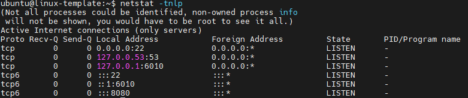
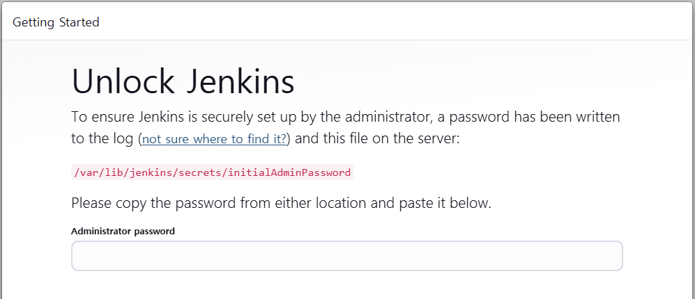
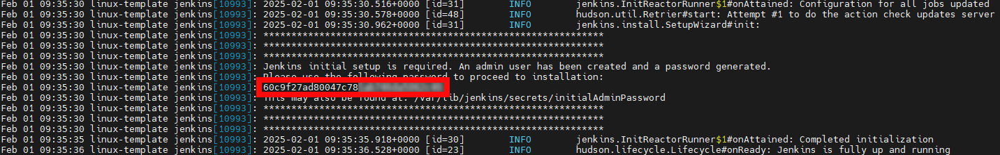
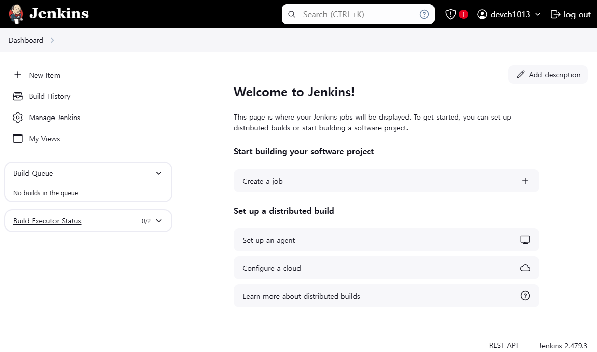
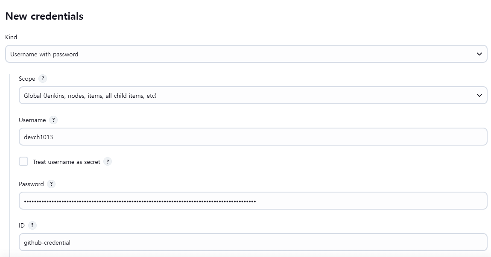

혼자 백엔드 개발을 하다보니 Spring 백엔드를 만들고 서빙할 때 빌드 파일을 서버에 직접 올려 실행하는 경우가 많았다. 예전에 잠깐 사용해보았던 Jenkins를 설정해 테스트, 빌드, 배포 자동화를 해보려고 한다.

# 설치
Jenkins를 사용할 서버는 ubuntu 22.04로 준비했다.
https://www.jenkins.io/doc/book/installing/linux/#debianubuntu
위 페이지를 참고하여 진행했다.

먼저 jenkins는 Java를 필요로 하기 때문에 자바 17 버전을 깔아주었다.
``` shell
sudo apt update
sudo apt install fontconfig openjdk-17-jre
```

그 다음 Jenkins의 공식 GPG 키를 다운받고 Jenkins를 소프트웨어 소스 목록에 추가해 apt로 설치 가능하게 만든 후 설치를 진행한다.
```shell
sudo wget -O /usr/share/keyrings/jenkins-keyring.asc \
  https://pkg.jenkins.io/debian-stable/jenkins.io-2023.key
echo "deb [signed-by=/usr/share/keyrings/jenkins-keyring.asc]" \
  https://pkg.jenkins.io/debian-stable binary/ | sudo tee \
  /etc/apt/sources.list.d/jenkins.list > /dev/null
sudo apt-get update
sudo apt-get install jenkins
```

그 후 systemctl로 jenkins의 상태를 확인하면 정상 설치가 되었는지 확인이 가능하다.
설치가 정상적으로 완료 되었다면 8080 포트로 서빙되고 있는 것을 확인할 수 있다.
{: width="80%" .center}

8080 포트로 들어가면 아래와 같은 화면이 뜬다.
{: width="80%" .center}

`journalctl -u jenkins.service`로 jenkins의 설치 로그를 확인하면 아래에 password를 확인할 수 있다.
{: width="80%" .center}

비밀번호를 입력하면 플러그인 설치 페이지가 뜨는데 기본 추천 플러그인을 선택했다.
설치 완료 후 사용할 계정 정보를 입력하고 사용할 url을 입력한다. 

# 둘러보기
첫 화면은 이렇다.
{: width="80%" .center}

먼저 Item을 새로 만들어야한다. Freestyle 타입으로 item을 만들어보았다.


