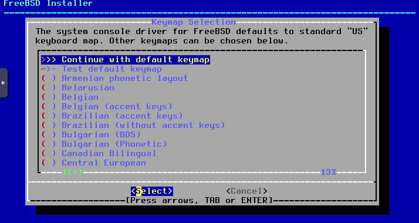

현재 집에서 Proxmox 서버를 설치하여 홈 서버로 쓰는 중이다. 프라이빗 네트워크의 사용이 필요해진 것 같아 설치하기로 했다. 오픈소스 방화벽 서비스 중 완전히 무료이고 업데이트가 상대적으로 자주 이루어지는 OPNsense를 쓰기로 결정했다.

# OPNsense 설치파일 다운로드
[다운로드 링크](https://opnsense.org/download/)

로그인 화면이 뜨면 
ID: installer, PW: opnsense로 입력한다. (설치용 계정)

로그인 하게되면 아래와 같은 설치 화면이 뜨게 된다.  

프라이빗 서버 설정
