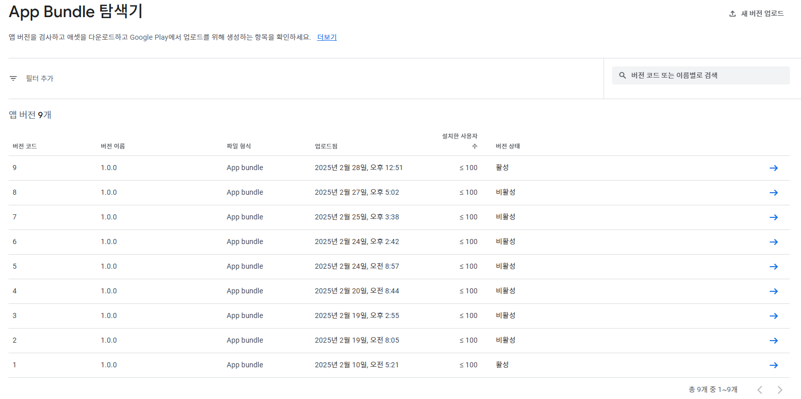

## 기획하게 된 계기  
여러 동아리들의 임원진을 하면서 항상 생각했고 불편했던 것이 출석 체크였다. 내가 했던 모든 동아리, 학회는 매주 고정 세션이 있고 출석을 확인하는 방식으로 운영되었다. 출석 방식도 다양했다. 직접 이름을 부르는 방식, 임원진이 알아서 체크하는 방식, 구글 폼을 QR로 찍어서 이름을 제출하는 방식 등이었다. 각 방식은 장단이 있지만 모두 불편함은 있었다.  
그래서 임원진, 회원 모두가 편한 출석체크 방식을 고민해봤다.  

## 왜 불편한가
내가 경험해본 방식들에 대해 정확히 어디서 불편한 점을 느끼는지 생각해보았다.  
**호명 방식**  
임원진 입장: 이름 부르는게 귀찮다. 출석 체크가 오래 걸린다.  
회원 입장: 출석 체크 시간이 오래 걸린다. 자기 이름이 불릴 때 까지 집중해서 듣고 있어야한다.  

**임원진이 알아서 체크**  
임원진 입장: 회원의 얼굴과 이름을 다 알고 있어야 한다. 임원진이 모르는 사람은 출석 체크가 안될 수도 ㅠㅠ  
회원 입장: 내가 출석 체크가 제대로 되었는지 확인하기가 어렵다. 분명히 한 번 씩은 휴먼 에러나 날 수 밖에 없다.  

