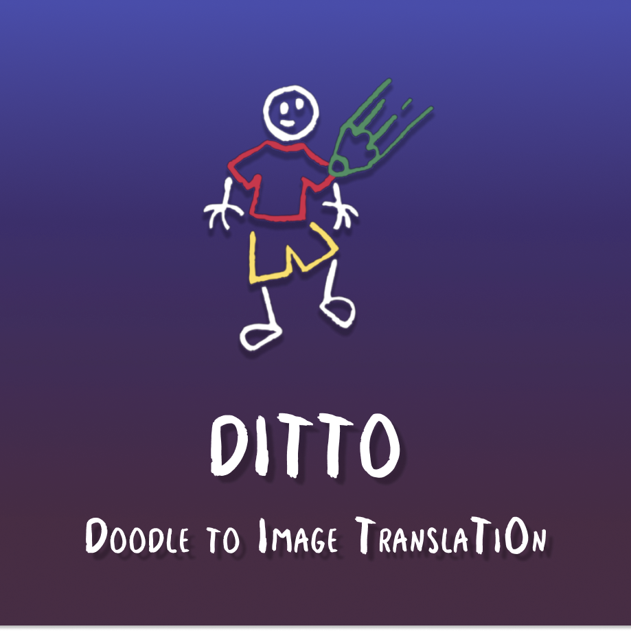
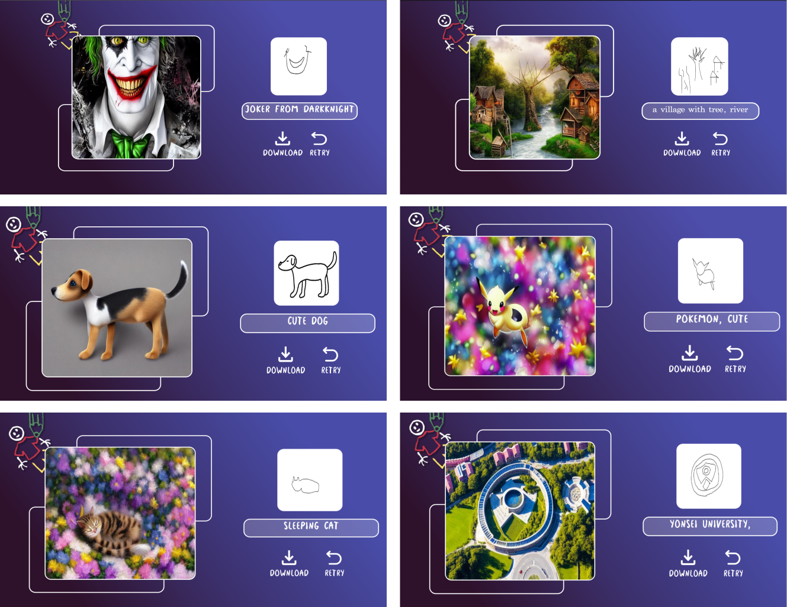

{: width="70%" .center}

## DITTO: Doodle to Image Translation  

**연세대학교 인공지능 학회 YAI 자체 경진대회 2회 YAICON 1위 프로젝트**

**담당 파트**
* PM
* BE(Django, AI 모델 서빙)
* 외부 접속 가능 데모 서버 구성(Ubuntu)
* 데이터셋 전처리

유저가 그린 낙서를 바탕으로 실제와 같은 이미지를 생성하는 웹 데모 프로젝트

**DEMO**  
{:width="80%" .center}

**Web View**

**Results**  
