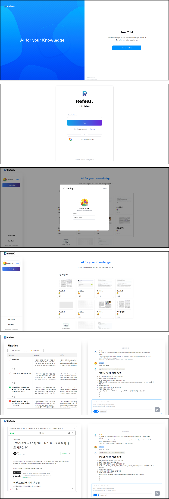

{: width="70%" .center}

## 생성 AI 기반 자료 조사 플랫폼

**서비스 목표:** 자료조사에 수반 되는 시간 소모적이고 반복적인 일들을 자동화함으로써 생산성을 극대화하고, 자료 이해와 인사이트 도출에 집중하고 아이디어에 힘을 실을 수 있도록 돕는 것

**담당 파트**  
* 서비스 기획
* 백엔드 아키텍처 설계
* MySQL Table 구조 설계
* RestfulAPI 명세 작성(Swagger)
* 개발 서버(proxmox), 배포 서버(aws) 환경 분리
* 서비스 서버 제작(Spring Boot)
	* JWT 인증, 인가
	* S3 파일 업로드, 다운로드
	* 구글 소셜 로그인
	* 기타 CRUD 엔드포인트
* AI 서버 제작(FastAPI)
	* 서비스 서버와 통신할 엔드포인트 제작
	* AI 인퍼런스 지연시간에 따른 상태관리
	* 챗봇 스트리밍 API 제작
* AWS 사용하여 프론트엔드, 백엔드 배포

2주간 데모 서비스 런칭 (종료상태)

**Spring 서비스 서버 코드:**   
**FastAPI AI 서버 코드:**   

**Web View**
{: width="70%" .center}

