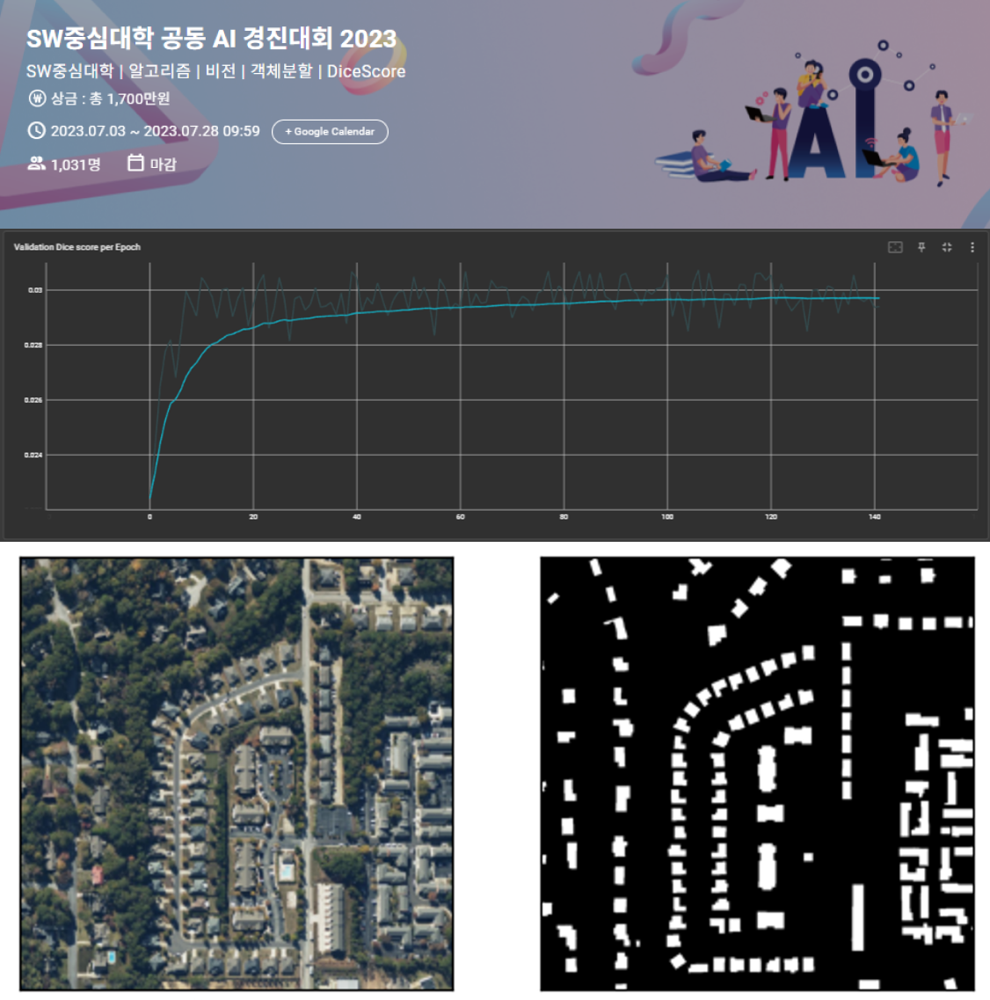

{: width="70%" .center}

## SW 중심대학 공동 AI 경진대회 2023  

**위성이미지 건물 영역 분할 DACON 경진대회**

**담당 파트**
* 데이터 전처리
* 모델 학습
* 기존 모델 적용 가능한 학습 템플릿 개발
* Segmentation mask 후가공 모델 개발
* Tensorboard 학습 시각화 파이프라인 개발
