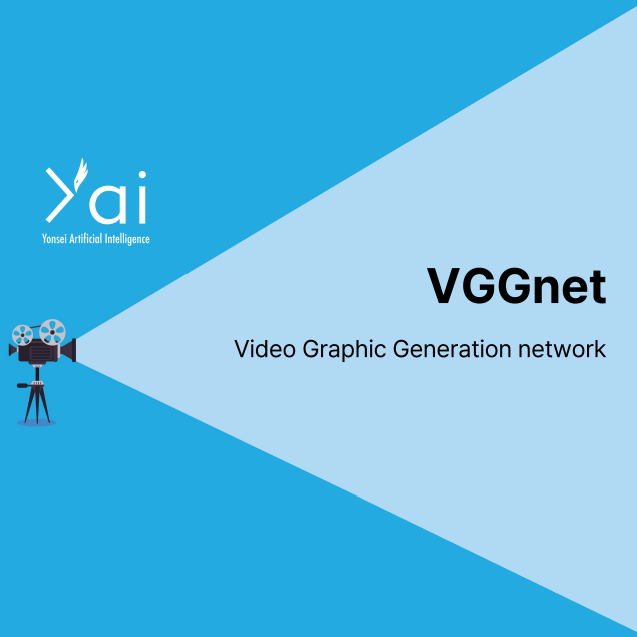
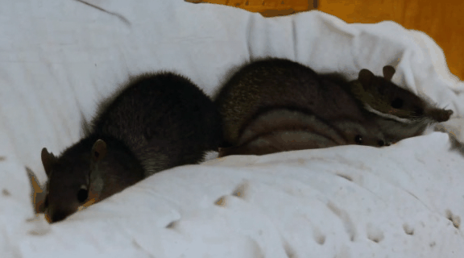
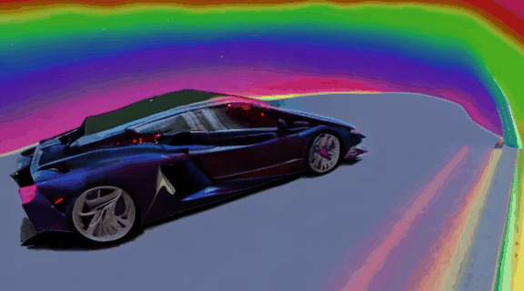
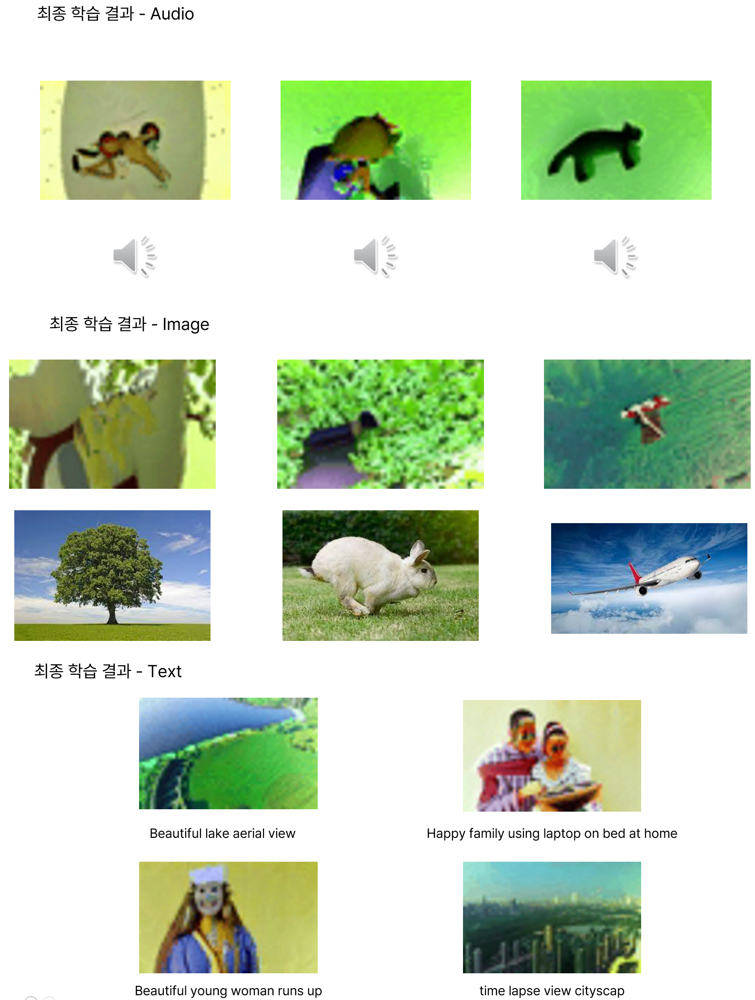

{: width="70%" .center}

## VGGnet: Video Graphic Generation Network  

**연세대학교 인공지능 학회 YAI 자체 경진대회 3회 YAICON 3위 프로젝트**

ImageBind와 Show-1(Video generation)을 합칠 수 있는 중간 임베딩 네트워크 개발  

**담당 파트**
* PM
* 모델 레이어 구성
* 모델 학습 코드 작성
* 데이터 전처리

**BaseLine Video Generation(Show-1)**  
* Sleeping shrews in small bed  
{: width="50%"}  
* A burning lamborghini driving on rainbow  
{: width="50%"}

**학습 방법**  
{: width="80%"}  

**최종 학습 결과**  
{:width="80%" .center}  

**발표자료 링크**  
[발표자료(pdf)](https://drive.google.com/file/d/1F_7qNc7GcCL2lNpsksOokPhFY4PSlXKQ/view?usp=sharing)  
[발표자료(ppt)](https://docs.google.com/presentation/d/1Va2QYMBIEo_fqTLkXDwFsMzSHS5Gu7cQ/edit?usp=sharing&ouid=100371990929234344560&rtpof=true&sd=true)

