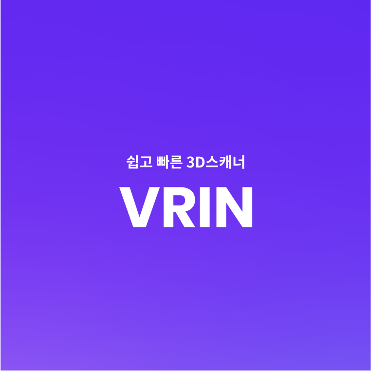

{: width="70%" .center}

## VRIN (3D 스캐닝 어플리케이션)

[RebuilderAI](https://rebuilderai.com/) 재직시에 제작한 서비스 (~2023.02.28)
 
모바일 3D 스캐닝 어플리케이션  
**서비스 링크:** [VRIN](https://vrin.co.kr/)  

**담당 파트**  
* 전체 백엔드(Spring Boot)
* 회사 내부망용 어드민 페이지 제작(Django)

**주요 개발 기능**  
* JWT 인증
* DB 테이블 설계
* 이미지 업로드 후 AI 서버와의 통신으로 3D 변환 파이프라인 제작
* AI 변환 소요 시간에 따른 에셋 상태 관리(Polling)
* Redis를 사용한 API 응답 캐싱
* 인증, 인가 서버 - 서비스 서버 - AI 서버간의 API 정의 및 통신
* 회사 내 타 서비스를 위한 elasticsearch 데이터 동기화
* FCM을 사용한 모바일 알림 기능 개발