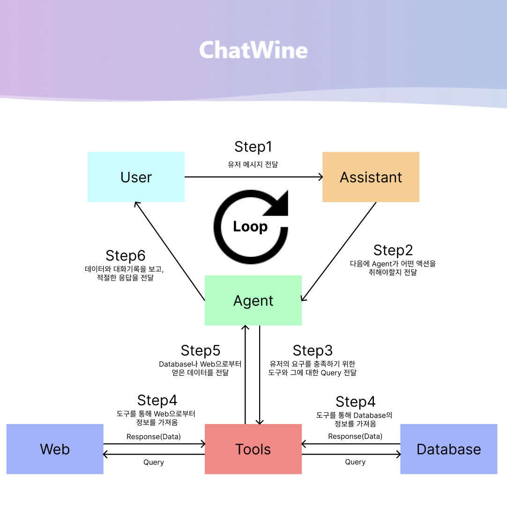
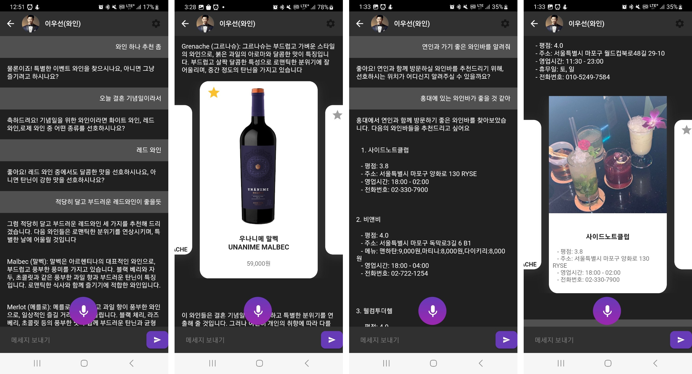

{: width="70%" .center}

# ChatWine  

Wine Database를 활용한 와인 추천 챗봇 시스템

**기능**
1. 와인 추천: 사용자의 성향을 파악하고, 적절한 와인을 추천합니다. 한국내에서 구매할 수 있는 와인을 추천하고, 구매 링크나 바로 구매하는 기능을 제공합니다.
2. 와인 Q&A: 사용자가 와인에 대한 질문을 하면 그에 적절한 정보를 제공합니다.
3. 와인바 추천: 사용자의 상황, 위치 등에 따라서 적절한 와인바를 추천합니다.

**Web View**
{: width="70%" .center}

**Mobile View**

