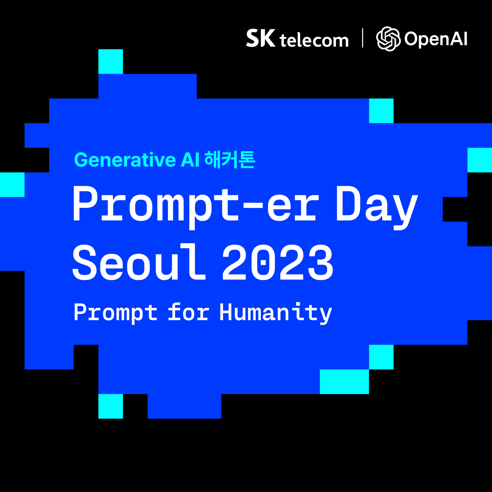
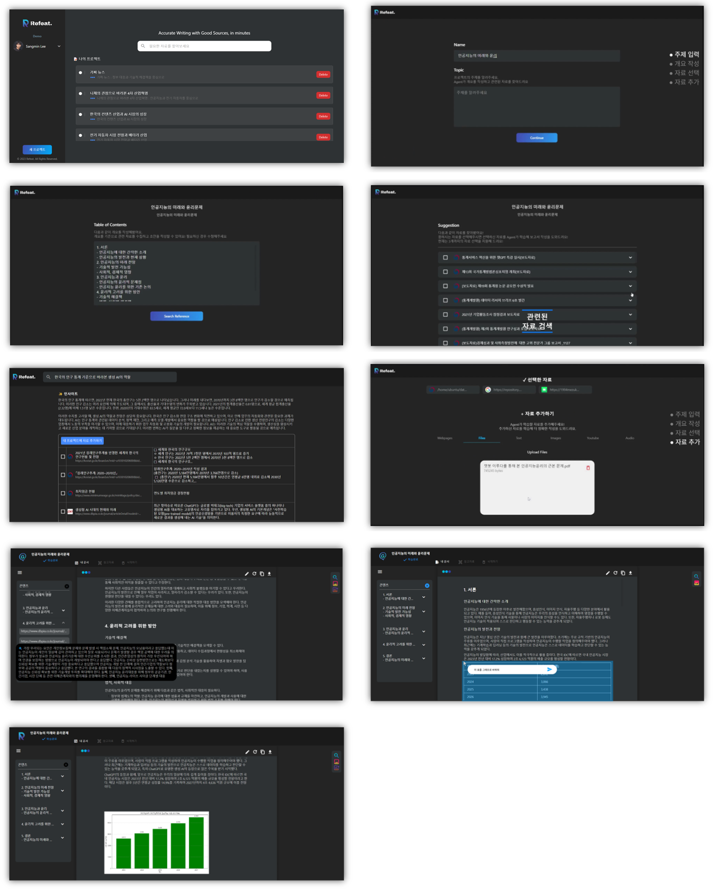

{: width="70%" .center}

## AI 기반 리서치 툴  

### 수상 경력
* Prompter Day Seoul 2023 SKT X OpenAI 해커톤 TOP 20 본선 진출
* 2023 학생 창업 유망팀 300 최종 선발
- 연세대학교 창업 경진대회 우수
- 2023 산학협력 Expo 인기상 수상

**담당 파트**
* 백엔드 코드(Django)
* AWS EC2, S3, Cloudfront, Route53
* DRF 사용하여 Restful API 제작, Swagger 문서 작성

**Demo Web**

**Backend Structure**
{:width="80%" .center}

**Demo Video**  
[Demo Video Link](https://www.youtube.com/watch?v=UkXOJnAxYkI)